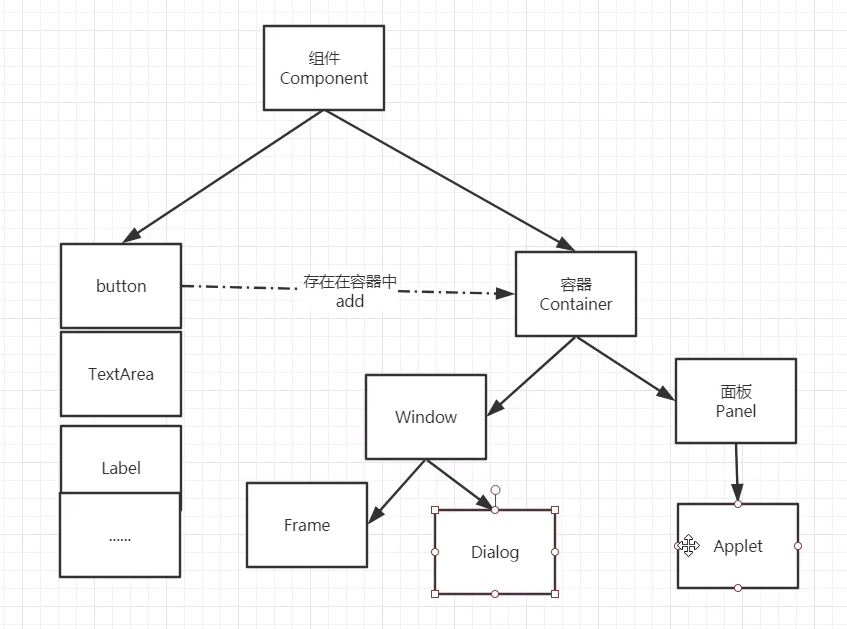
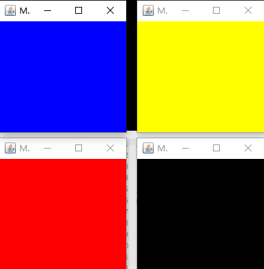
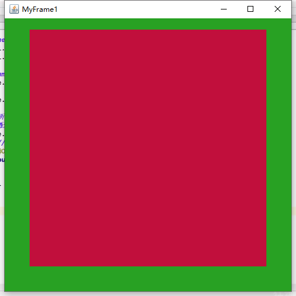

# GUI

## 简介

* GUI的技术核心：Swing AWT

* 缺点：界面不美观、且需要jre环境

* 学习原因：

1、可以写出自己心中想要的小工具

2、工作可能用到

3、了解MVC架构、了解监听

## AWT

1、包含了很多类和接口！GUI：图像用户界面

2、元素：窗口、按钮、文本框

3、java.awt包



### Frame

```java
package com.haer.demo01;

import java.awt.*;

public class TestFrame {
    public static void main(String[] args) {
        //Frame
        //设置窗口名称
        Frame frame = new Frame("哈儿的第一个Java图形界面");

        //需要设置窗口的可见性
        frame.setVisible(true);

        //设置窗口大小
        frame.setSize(400,400);

        //设置背景颜色
        frame.setBackground(new Color(49, 143, 42));

        //设置弹出初始位置
        frame.setLocation(200,200);

        //设置大小固定
        frame.setResizable(false);
    }
}
```

运行后弹出窗口


此时我们发现点击右上角不能关闭窗口，只能停止java程序

封装一个弹窗类

```java
//封装一个弹窗工具
public class MyFrame extends Frame {
    static int id = 0;//可能存在多个窗口，用来计数
    public MyFrame(int x, int y, int w, int h, Color color) {
        super("MyFrame" + (++id));//每次new调用父类构造方法，id＋1
        setBackground(color);
        setBounds(x, y, w, h);
        setVisible(true);
    }
}
```

测试

```java
public class TestFrame2 {
    public static void main(String[] args) {
        MyFrame myFrame1 = new MyFrame(100, 100, 200, 200, Color.blue);
        MyFrame myFrame2 = new MyFrame(300, 100, 200, 200, Color.yellow);
        MyFrame myFrame3 = new MyFrame(100, 300, 200, 200, Color.red);
        MyFrame myFrame4 = new MyFrame(300, 300, 200, 200, Color.black);
    }
}
```



### Panel

面板：可以看成一个空间（div），不能单独存在

```java
package com.haer.demo01;

import java.awt.*;
import java.awt.event.WindowAdapter;
import java.awt.event.WindowEvent;

public class MyPanel {
    public static void main(String[] args) {
//        Frame frame = new Frame();
        //布局的概念
        Panel panel = new Panel();

        //直接使用封装的模板了
        MyFrame myFrame = new MyFrame(300,300,500,500,new Color(40,161,35));

        //设置布局,暂时设置null
        myFrame.setLayout(null);

        //panel设置坐标，相对于frame
        panel.setBounds(50,50,400,400);
        panel.setBackground(new Color(193,15,60));

        //frame.add(panel)add加入到frame
        myFrame.add(panel);

        //监听事件：监听窗口关闭事件 System.exit(0)
        //这样点击右上角可以关闭窗口了
        myFrame.addWindowListener(new WindowAdapter() {
            @Override
            public void windowClosing(WindowEvent e) {
                System.exit(0);
            }
        });
    }
}

```



### 布局管理器

* 流式布局

```java
package com.haer.demo01;

import java.awt.*;

public class TestFlowLayout {
    public static void main(String[] args) {
        MyFrame myFrame = new MyFrame(300,300,500,500,new Color(40,161,35));

        Button button1 = new Button("button1");
        Button button2 = new Button("button2");
        Button button3 = new Button("button3");
        //设置流式布局，设置左右居中
        myFrame.setLayout(new FlowLayout());
//        myFrame.setLayout(new FlowLayout(FlowLayout.LEFT));
//        myFrame.setLayout(new FlowLayout(FlowLayout.RIGHT));
//        myFrame.setLayout(new FlowLayout(FlowLayout.CENTER));

        //添加按钮
        myFrame.add(button1);
        myFrame.add(button2);
        myFrame.add(button3);

    }
}

```

* 东南西北中

```java
package com.haer.demo01;

import java.awt.*;

public class TestBorderLayout {
    public static void main(String[] args) {
        MyFrame myFrame = new MyFrame(300,300,500,500,new Color(40,161,35));

        Button east = new Button("east");
        Button west = new Button("west");
        Button south = new Button("south");
        Button north = new Button("north");
        Button center = new Button("center");

        myFrame.add(east, BorderLayout.EAST);
        myFrame.add(west, BorderLayout.WEST);
        myFrame.add(south, BorderLayout.SOUTH);
        myFrame.add(north, BorderLayout.NORTH);
        myFrame.add(center, BorderLayout.CENTER);
        
    }
}

```

* 表格布局

```java
package com.haer.demo01;

import java.awt.*;

public class TestGridLayout {
    public static void main(String[] args) {
        MyFrame myFrame = new MyFrame(300,300,500,500,new Color(40,161,35));

        Button button1 = new Button("button1");
        Button button2 = new Button("button2");
        Button button3 = new Button("button3");
        Button button4 = new Button("button4");
        Button button5 = new Button("button5");
        Button button6 = new Button("button6");

        myFrame.setLayout(new GridLayout(3 ,2));

        myFrame.add(button1);
        myFrame.add(button2);
        myFrame.add(button3);
        myFrame.add(button4);
        myFrame.add(button5);
        myFrame.add(button6);

        myFrame.pack();//java函数，自动布局，可以不加
    }
}

```

一个Demo

```java
package com.haer.demo01;

import java.awt.*;

public class Demo {
    public static void main(String[] args) {
        MyFrame myFrame = new MyFrame(300,300,500,500,new Color(40,161,35));

        myFrame.setLayout(new GridLayout(2,1));

        //四个面板
        Panel panel1 = new Panel(new BorderLayout());
        Panel panel2 = new Panel(new GridLayout(2,1));
        Panel panel3 = new Panel(new BorderLayout());
        Panel panel4 = new Panel(new GridLayout(2,2));

        //上班部分
        panel1.add(new Button("East-1"),BorderLayout.EAST);
        panel1.add(new Button("West-1"),BorderLayout.WEST);
        panel2.add(new Button("p2-btn-1"));
        panel2.add(new Button("p2-btn-2"));
        panel1.add(panel2,BorderLayout.CENTER);

        //下半部分
        panel3.add(new Button("East-2"),BorderLayout.EAST);
        panel3.add(new Button("West-2"),BorderLayout.WEST);
        for (int i = 0; i < 4; i++) {
            panel4.add(new Button("for-"+i));
        }
        panel3.add(panel4,BorderLayout.CENTER);

        myFrame.add(panel1);
        myFrame.add(panel3);

    }
}

```

效果


### 事件监听

事件监听：监听事件发生

```java
package com.haer.demo2;

import com.haer.demo01.MyFrame;

import java.awt.*;
import java.awt.event.WindowAdapter;
import java.awt.event.WindowEvent;

public class TestActionEvent {
    //按下按钮，触发一些事件
    public static void main(String[] args) {
        Frame frame = new Frame();

        Button button1 = new Button("button1");
        Button button2 = new Button("button2");
        //可以显示的定义触发会返回的命名，不定义，会走默认值
        button1.setActionCommand("button1");
        button2.setActionCommand("button2");

        //因为，addActionListener（）需要一个ActionListener，所以我们需要构造一个ActionListener
        MyActionListener myActionListener = new MyActionListener();
        button1.addActionListener(myActionListener);
        button2.addActionListener(myActionListener);

        frame.add(button1,BorderLayout.CENTER);
        frame.add(button2,BorderLayout.WEST);
        frame.pack();
        frame.setVisible(true);

        windowClose(frame);

    }

    //关闭窗口方法
    private static void windowClose(Frame frame){
        frame.addWindowListener(new WindowAdapter() {
            @Override
            public void windowClosing(WindowEvent e) {
                System.exit(0);
            }
        });
    }
}

class MyActionListener implements ActionListener {
    public void actionPerformed(ActionEvent e) {
//        点击按钮打印e.getActionCommand()获得按钮信息
        System.out.println("哈儿"+e.getActionCommand());
    }
}
```

### 输入框TextField

```java
package com.haer.demo2;

import java.awt.*;
import java.awt.event.ActionEvent;
import java.awt.event.ActionListener;

public class TestText01 {
    public static void main(String[] args) {
        new MyFrame();
    }
}

class MyFrame extends Frame{
    public MyFrame(){
        TextField textField = new TextField();
        add(textField);

        //监听文本框输入的文字
        textField.addActionListener(new MyListen());

        //设置替换编码
        textField.setEchoChar('*');

        setVisible(true);
        pack();
    }
}

class MyListen implements ActionListener {

    public void actionPerformed(ActionEvent e) {
        //获得一些资源,返回一个对象
        TextField textField = (TextField) e.getSource();
        //按回车后获得输入框中的文本
        System.out.println(textField.getText());
        //回车后清楚文本框内容
        textField.setText("");

    }
}
```

### 简易计算器

```java
package com.haer.demo2;

import java.awt.*;
import java.awt.event.ActionEvent;
import java.awt.event.ActionListener;

//简易计算器
public class TestCalc {
    public static void main(String[] args) {
        new Calculator();
    }
}

//计算器类
class Calculator extends Frame{
    public Calculator(){
        //3个文本框
        TextField num1 = new TextField(10);//字符数
        TextField num2 = new TextField(10);//字符数
        TextField num3 = new TextField(20);//字符数

        //一个按钮
        Button button = new Button("=");

        button.addActionListener(new MyCalcListener(num1,num2,num3));

        //一个标签
        Label label = new Label("+");

        //布局
        setLayout(new FlowLayout());

        add(num1);
        add(label);
        add(num2);
        add(button);
        add(num3);

        pack();
        setVisible(true);
    }
}

//监听器类
class MyCalcListener implements ActionListener{

    //获取三个变量
    private TextField num1,num2,num3;

    public MyCalcListener(TextField num1,TextField num2,TextField num3){
        this.num1 = num1;
        this.num2 = num2;
        this.num3 = num3;
    }

    public void actionPerformed(ActionEvent e) {
        //获得加数和被加数
        int n1 = Integer.parseInt(num1.getText());
        int n2 = Integer.parseInt(num2.getText());
        //将这个值+加起来放到第三个框
        num3.setText(""+(n1+n2));
        //清楚前面俩个框
        num1.setText("");
        num2.setText("");
    }
}

```

