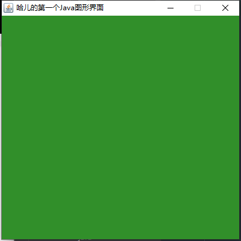

# GUI

## 简介

* GUI的技术核心：Swing AWT

* 缺点：界面不美观、且需要jre环境

* 学习原因：

1、可以写出自己心中想要的小工具

2、工作可能用到

3、了解MVC架构、了解监听

## AWT

1、包含了很多类和接口！GUI：图像用户界面

2、元素：窗口、按钮、文本框

3、java.awt包


### Frame

```java
package com.haer.demo01;

import java.awt.*;

public class TestFrame {
    public static void main(String[] args) {
        //Frame
        //设置窗口名称
        Frame frame = new Frame("哈儿的第一个Java图形界面");

        //需要设置窗口的可见性
        frame.setVisible(true);

        //设置窗口大小
        frame.setSize(400,400);

        //设置背景颜色
        frame.setBackground(new Color(49, 143, 42));

        //设置弹出初始位置
        frame.setLocation(200,200);

        //设置大小固定
        frame.setResizable(false);
    }
}
```

运行后弹出窗口



此时我们发现点击右上角不能关闭窗口，只能停止java程序

封装一个弹窗类

```java
//封装一个弹窗工具
public class MyFrame extends Frame {
    static int id = 0;//可能存在多个窗口，用来计数
    public MyFrame(int x, int y, int w, int h, Color color) {
        super("MyFrame" + (++id));//每次new调用父类构造方法，id＋1
        setBackground(color);
        setBounds(x, y, w, h);
        setVisible(true);
    }
}
```

测试

```java
public class TestFrame2 {
    public static void main(String[] args) {
        MyFrame myFrame1 = new MyFrame(100, 100, 200, 200, Color.blue);
        MyFrame myFrame2 = new MyFrame(300, 100, 200, 200, Color.yellow);
        MyFrame myFrame3 = new MyFrame(100, 300, 200, 200, Color.red);
        MyFrame myFrame4 = new MyFrame(300, 300, 200, 200, Color.black);
    }
}
```


### Panel

面板：可以看成一个空间（div），不能单独存在

```java
package com.haer.demo01;

import java.awt.*;
import java.awt.event.WindowAdapter;
import java.awt.event.WindowEvent;

public class MyPanel {
    public static void main(String[] args) {
//        Frame frame = new Frame();
        //布局的概念
        Panel panel = new Panel();

        //直接使用封装的模板了
        MyFrame myFrame = new MyFrame(300,300,500,500,new Color(40,161,35));

        //设置布局,暂时设置null
        myFrame.setLayout(null);

        //panel设置坐标，相对于frame
        panel.setBounds(50,50,400,400);
        panel.setBackground(new Color(193,15,60));

        //frame.add(panel)add加入到frame
        myFrame.add(panel);

        //监听事件：监听窗口关闭事件 System.exit(0)
        //这样点击右上角可以关闭窗口了
        myFrame.addWindowListener(new WindowAdapter() {
            @Override
            public void windowClosing(WindowEvent e) {
                System.exit(0);
            }
        });
    }
}

```


### 布局管理器

* 流式布局

```java
package com.haer.demo01;

import java.awt.*;

public class TestFlowLayout {
    public static void main(String[] args) {
        MyFrame myFrame = new MyFrame(300,300,500,500,new Color(40,161,35));

        Button button1 = new Button("button1");
        Button button2 = new Button("button2");
        Button button3 = new Button("button3");
        //设置流式布局，设置左右居中
        myFrame.setLayout(new FlowLayout());
//        myFrame.setLayout(new FlowLayout(FlowLayout.LEFT));
//        myFrame.setLayout(new FlowLayout(FlowLayout.RIGHT));
//        myFrame.setLayout(new FlowLayout(FlowLayout.CENTER));

        //添加按钮
        myFrame.add(button1);
        myFrame.add(button2);
        myFrame.add(button3);

    }
}

```

* 东南西北中

```java
package com.haer.demo01;

import java.awt.*;

public class TestBorderLayout {
    public static void main(String[] args) {
        MyFrame myFrame = new MyFrame(300,300,500,500,new Color(40,161,35));

        Button east = new Button("east");
        Button west = new Button("west");
        Button south = new Button("south");
        Button north = new Button("north");
        Button center = new Button("center");

        myFrame.add(east, BorderLayout.EAST);
        myFrame.add(west, BorderLayout.WEST);
        myFrame.add(south, BorderLayout.SOUTH);
        myFrame.add(north, BorderLayout.NORTH);
        myFrame.add(center, BorderLayout.CENTER);
        
    }
}

```

* 表格布局

```java
package com.haer.demo01;

import java.awt.*;

public class TestGridLayout {
    public static void main(String[] args) {
        MyFrame myFrame = new MyFrame(300,300,500,500,new Color(40,161,35));

        Button button1 = new Button("button1");
        Button button2 = new Button("button2");
        Button button3 = new Button("button3");
        Button button4 = new Button("button4");
        Button button5 = new Button("button5");
        Button button6 = new Button("button6");

        myFrame.setLayout(new GridLayout(3 ,2));

        myFrame.add(button1);
        myFrame.add(button2);
        myFrame.add(button3);
        myFrame.add(button4);
        myFrame.add(button5);
        myFrame.add(button6);

        myFrame.pack();//java函数，自动布局，可以不加
    }
}

```

一个Demo

```java
package com.haer.demo01;

import java.awt.*;

public class Demo {
    public static void main(String[] args) {
        MyFrame myFrame = new MyFrame(300,300,500,500,new Color(40,161,35));

        myFrame.setLayout(new GridLayout(2,1));

        //四个面板
        Panel panel1 = new Panel(new BorderLayout());
        Panel panel2 = new Panel(new GridLayout(2,1));
        Panel panel3 = new Panel(new BorderLayout());
        Panel panel4 = new Panel(new GridLayout(2,2));

        //上班部分
        panel1.add(new Button("East-1"),BorderLayout.EAST);
        panel1.add(new Button("West-1"),BorderLayout.WEST);
        panel2.add(new Button("p2-btn-1"));
        panel2.add(new Button("p2-btn-2"));
        panel1.add(panel2,BorderLayout.CENTER);

        //下半部分
        panel3.add(new Button("East-2"),BorderLayout.EAST);
        panel3.add(new Button("West-2"),BorderLayout.WEST);
        for (int i = 0; i < 4; i++) {
            panel4.add(new Button("for-"+i));
        }
        panel3.add(panel4,BorderLayout.CENTER);

        myFrame.add(panel1);
        myFrame.add(panel3);

    }
}

```

效果


### 事件监听

事件监听：监听事件发生

```java
package com.haer.demo2;

import com.haer.demo01.MyFrame;

import java.awt.*;
import java.awt.event.WindowAdapter;
import java.awt.event.WindowEvent;

public class TestActionEvent {
    //按下按钮，触发一些事件
    public static void main(String[] args) {
        Frame frame = new Frame();

        Button button1 = new Button("button1");
        Button button2 = new Button("button2");
        //可以显示的定义触发会返回的命名，不定义，会走默认值
        button1.setActionCommand("button1");
        button2.setActionCommand("button2");

        //因为，addActionListener（）需要一个ActionListener，所以我们需要构造一个ActionListener
        MyActionListener myActionListener = new MyActionListener();
        button1.addActionListener(myActionListener);
        button2.addActionListener(myActionListener);

        frame.add(button1,BorderLayout.CENTER);
        frame.add(button2,BorderLayout.WEST);
        frame.pack();
        frame.setVisible(true);

        windowClose(frame);

    }

    //关闭窗口方法
    private static void windowClose(Frame frame){
        frame.addWindowListener(new WindowAdapter() {
            @Override
            public void windowClosing(WindowEvent e) {
                System.exit(0);
            }
        });
    }
}

class MyActionListener implements ActionListener {
    public void actionPerformed(ActionEvent e) {
//        点击按钮打印e.getActionCommand()获得按钮信息
        System.out.println("哈儿"+e.getActionCommand());
    }
}
```

### 输入框TextField

```java
package com.haer.demo2;

import java.awt.*;
import java.awt.event.ActionEvent;
import java.awt.event.ActionListener;

public class TestText01 {
    public static void main(String[] args) {
        new MyFrame();
    }
}

class MyFrame extends Frame{
    public MyFrame(){
        TextField textField = new TextField();
        add(textField);

        //监听文本框输入的文字
        textField.addActionListener(new MyListen());

        //设置替换编码
        textField.setEchoChar('*');

        setVisible(true);
        pack();
    }
}

class MyListen implements ActionListener {

    public void actionPerformed(ActionEvent e) {
        //获得一些资源,返回一个对象
        TextField textField = (TextField) e.getSource();
        //按回车后获得输入框中的文本
        System.out.println(textField.getText());
        //回车后清楚文本框内容
        textField.setText("");

    }
}
```

### 简易计算器

```java
package com.haer.demo2;

import java.awt.*;
import java.awt.event.ActionEvent;
import java.awt.event.ActionListener;

//简易计算器
public class TestCalc {
    public static void main(String[] args) {
        new Calculator();
    }
}

//计算器类
class Calculator extends Frame{
    public Calculator(){
        //3个文本框
        TextField num1 = new TextField(10);//字符数
        TextField num2 = new TextField(10);//字符数
        TextField num3 = new TextField(20);//字符数

        //一个按钮
        Button button = new Button("=");

        button.addActionListener(new MyCalcListener(num1,num2,num3));

        //一个标签
        Label label = new Label("+");

        //布局
        setLayout(new FlowLayout());

        add(num1);
        add(label);
        add(num2);
        add(button);
        add(num3);

        pack();
        setVisible(true);
    }
}

//监听器类
class MyCalcListener implements ActionListener{

    //获取三个变量
    private TextField num1,num2,num3;

    public MyCalcListener(TextField num1,TextField num2,TextField num3){
        this.num1 = num1;
        this.num2 = num2;
        this.num3 = num3;
    }

    public void actionPerformed(ActionEvent e) {
        //获得加数和被加数
        int n1 = Integer.parseInt(num1.getText());
        int n2 = Integer.parseInt(num2.getText());
        //将这个值+加起来放到第三个框
        num3.setText(""+(n1+n2));
        //清楚前面俩个框
        num1.setText("");
        num2.setText("");
    }
}

```

**面向对象改造代码：**

```java
package com.haer.demo2;

import java.awt.*;
import java.awt.event.ActionEvent;
import java.awt.event.ActionListener;

//简易计算器
public class TestCalc {
    public static void main(String[] args) {
        new Calculator().loadFrame();
    }
}

//计算器类
class Calculator extends Frame {

    TextField num1, num2, num3;

    public void loadFrame() {
        //3个文本框
        num1 = new TextField(10);//字符数
        num2 = new TextField(10);//字符数
        num3 = new TextField(20);//字符数

        //一个按钮
        Button button = new Button("=");

        button.addActionListener(new MyCalcListener(this));

        //一个标签
        Label label = new Label("+");

        //布局
        setLayout(new FlowLayout());

        add(num1);
        add(label);
        add(num2);
        add(button);
        add(num3);

        pack();
        setVisible(true);
    }

}

//监听器类
class MyCalcListener implements ActionListener {

    //获取三个变量
//    private TextField num1, num2, num3;
    private Calculator calculator;

    public MyCalcListener(Calculator calculator) {
        this.calculator = calculator;
    }

    public void actionPerformed(ActionEvent e) {
        //获得加数和被加数
        //将这个值+加起来放到第三个框
        //清楚前面俩个框
        int n1 = Integer.parseInt(calculator.num1.getText());
        int n2 = Integer.parseInt(calculator.num2.getText());
        calculator.num3.setText(""+(n1+n2));
        calculator.num1.setText("");
        calculator.num2.setText("");
    }
}

```

**内部类改造代码：**

```java
package com.haer.demo2;

import java.awt.*;
import java.awt.event.ActionEvent;
import java.awt.event.ActionListener;

//简易计算器
public class TestCalc {
    public static void main(String[] args) {
        new Calculator().loadFrame();
    }
}

//计算器类
class Calculator extends Frame {

    TextField num1, num2, num3;

    public void loadFrame() {
        //3个文本框
        num1 = new TextField(10);//字符数
        num2 = new TextField(10);//字符数
        num3 = new TextField(20);//字符数

        //一个按钮
        Button button = new Button("=");

        button.addActionListener(new MyCalcListener());

        //一个标签
        Label label = new Label("+");

        //布局
        setLayout(new FlowLayout());

        add(num1);
        add(label);
        add(num2);
        add(button);
        add(num3);

        pack();
        setVisible(true);
    }
    //监听器类
    //内部类：可以畅通无阻的访问外部类的属性和方法
    private class MyCalcListener implements ActionListener {

        public void actionPerformed(ActionEvent e) {
            //获得加数和被加数
            //将这个值+加起来放到第三个框
            //清楚前面俩个框
            int n1 = Integer.parseInt(num1.getText());
            int n2 = Integer.parseInt(num2.getText());
            num3.setText(""+(n1+n2));
            num1.setText("");
            num2.setText("");
        }
    }
}

```

### 画笔Paint

```java
package com.haer.demo3;

import java.awt.*;

public class TestPaint {
    public static void main(String[] args) {
        new MyPaint().loadFrame();
    }
}

class MyPaint extends Frame{

    public void loadFrame(){
        setBounds(200,200,600,500);
        setVisible(true);
    }

    @Override
    public void paint(Graphics g) {
        //颜色
        g.setColor(Color.red);
        //画一个圆
        g.drawOval(100,100,100,100);
        //实心圆
        g.fillOval(200,100,100,100);

        g.setColor(Color.green);
        //矩形
        g.fillRect(150,200,200,200);

        //画笔用完还原到最初的颜色
        g.setColor(Color.black);
    }
}

```

### 鼠标监听

实现点击鼠标画一个点

```java
package com.haer.demo3;

import java.awt.*;
import java.awt.event.MouseAdapter;
import java.awt.event.MouseEvent;
import java.util.ArrayList;
import java.util.Iterator;

public class TestMouseListener {
    public static void main(String[] args) {
        new MyFrame("画图");
    }
}

class MyFrame extends Frame{
    //存鼠标点击的点
    ArrayList points;

    public MyFrame(String title){
        super(title);
        setBounds(200,200,400,300);
        //存鼠标点击的点
        points = new ArrayList<>();
        //鼠标监听器，正对窗口
        this.addMouseListener(new MyMouseListener());
        setVisible(true);
    }

    @Override
    public void paint(Graphics g) {
        //画画监听鼠标事件
        Iterator iterator = points.iterator();
        while (iterator.hasNext()){
            Point point = (Point) iterator.next();
            //点的颜色，大小
            g.setColor(Color.blue);
            g.fillOval(point.x,point.y,10,10);
        }
    }

    //添加一个点到界面上
    public void addPoint(Point point){
        points.add(point);
    }

    //适配器模式
    private class MyMouseListener extends MouseAdapter{
        //鼠标，按下，弹起
        @Override
        public void mousePressed(MouseEvent e) {
            MyFrame myFrame = (MyFrame) e.getSource();
            //这里点击时在界面上画一个点
            //这个点的位置就是鼠标的位置
            myFrame.addPoint(new Point(e.getX(), e.getY()));

            //每次点击鼠标需要重新画一遍
            myFrame.repaint();
        }
    }
}
```

### 窗口监听

俩个常用的监听窗口事件

```java
package com.haer.demo3;

import java.awt.*;
import java.awt.event.WindowAdapter;
import java.awt.event.WindowEvent;

public class TestWindow {
    public static void main(String[] args) {
        new WindowFrame();
    }
}

class WindowFrame extends Frame{
    public WindowFrame(){
        setBackground(Color.CYAN);
        setBounds(100,100,200,200);
        setVisible(true);

        addWindowListener(
                //匿名内部类
                new WindowAdapter() {
                    //这里重写俩个使用较多的方法
                    //关闭窗口,点击x时调用
                    @Override
                    public void windowClosing(WindowEvent e) {
                        System.out.println("windowClosing");
                        System.exit(0);//正常关闭程序
                    }

                    //激活窗口
                    @Override
                    public void windowActivated(WindowEvent e) {
                        System.out.println("windowActivated");
                    }
                }
        );
    }
}

```

### 键盘监听

监听按下的哪个按钮

```java
package com.haer.demo3;

import java.awt.*;
import java.awt.event.KeyAdapter;
import java.awt.event.KeyEvent;

public class TestKeyListener {
    public static void main(String[] args) {
        
    }
}

class KeyFrame extends Frame{
    public KeyFrame(){
        setBounds(100,100,200,200);
        setVisible(true);
        
        this.addKeyListener(
                new KeyAdapter() {
                    //重写键盘按下方法
                    @Override
                    public void keyPressed(KeyEvent e) {
                        //获得键盘的码
                        int keyCode = e.getKeyCode();
                        System.out.println(keyCode);
                        //判断按下了上键
                        if(keyCode == KeyEvent.VK_UP){
                            System.out.println("按下了上键");
                        }
                    }
                }
        );
    }
}

```

## Swing

### 窗体JFrame

```java
package com.haer.demo04;

import javax.swing.*;
import java.awt.*;

public class JFrameDemo {
    public static void main(String[] args) {
        new MyJFrame();
    }
}

class MyJFrame extends JFrame{
    public MyJFrame(){
        setVisible(true);
        setBounds(100,100,200,200);
        //这个是顶级窗口JFrame的颜色
        setBackground(Color.CYAN);
        JLabel label = new JLabel("喜欢偷懒的哈儿");
        //设置文字
        add(label);
        //设置文字居中
        label.setHorizontalAlignment(SwingConstants.CENTER);
        //设置这个label的颜色，因为label完全覆盖在窗口JFrame上层了
        getContentPane().setBackground(Color.red);
        //关闭事件
        setDefaultCloseOperation(WindowConstants.EXIT_ON_CLOSE);
    }
}

```

### 弹窗JDialog

用来被弹出，默认有关闭窗口事件

```java
package com.haer.demo04;

import javax.swing.*;
import java.awt.*;
import java.awt.event.ActionEvent;
import java.awt.event.ActionListener;

public class DialogDemo {
    public static void main(String[] args) {
        new MyJFrame2();
    }
}

class MyJFrame2 extends JFrame{
    public MyJFrame2(){
        setVisible(true);
        setSize(700,500);
        setDefaultCloseOperation(WindowConstants.EXIT_ON_CLOSE);
        //JFrame设置一个容器
        Container contentPane = this.getContentPane();
        //绝对布局
        contentPane.setLayout(null);
        //按钮
        JButton button = new JButton("点击弹出");
        button.setBounds(30,30,200,50);
        //按钮监听事件，弹出一个弹出
        button.addActionListener(
                new ActionListener() {
                    @Override
                    public void actionPerformed(ActionEvent e) {
                        //弹窗
                        new MyDialogDemo();
                    }
                }
        );
        //把按钮添加到容器
        contentPane.add(button);
    }
}

//弹窗
class MyDialogDemo extends JDialog{
    public MyDialogDemo() {
        this.setVisible(true);
        this.setBounds(100,100,500,500);
        //弹窗默认都有关闭窗口的功能所以不需要
        //this.setDefaultCloseOperation(WindowConstants.EXIT_ON_CLOSE);

        Container contentPane = this.getContentPane();
        contentPane.setLayout(null);

        contentPane.add(new Label("这是一个弹出窗口"));
    }
}
```


### 标签JLabel

* 画一个图标Icon

```java
package com.haer.demo04;

import javax.swing.*;
import java.awt.*;

public class IconDemo extends JFrame implements Icon {

    private int width;
    private int height;

    public IconDemo() {
    }

    public IconDemo(int width, int height) {
        this.width = width;
        this.height = height;
    }

    public void init(){
        IconDemo iconDemo = new IconDemo(15, 15);
        //图片放在标签上，也可以放在按钮上
        //标题，图标，居中
        JLabel label = new JLabel("iconTest", iconDemo, SwingConstants.CENTER);
        //放在容器中
        Container contentPane = getContentPane();
        contentPane.add(label);
        //设置
        this.setVisible(true);
        this.setBounds(100,100,300,300);
        this.setDefaultCloseOperation(WindowConstants.EXIT_ON_CLOSE);
    }

    public static void main(String[] args) {
        new IconDemo().init();
    }

    @Override
    public void paintIcon(Component c, Graphics g, int x, int y) {
        //画一个实心圆
        g.fillOval(x,y,width,height);
    }

    @Override
    public int getIconWidth() {
        return this.width;
    }

    @Override
    public int getIconHeight() {
        return this.height;
    }
}

```

* 将图片画上去ImageIcon

```java
package com.haer.demo04;

import javax.swing.*;
import java.awt.*;
import java.net.URL;

public class ImageIconDemo extends JFrame {
    public static void main(String[] args) {
        new ImageIconDemo();
    }

    public ImageIconDemo(){
        //图片标题
        JLabel label = new JLabel("ImageIcon");
        //获取当前目录下的test.png图片地址//必须保证target中同级目录下也有这个图片文件，否则一直找不到
        URL url = ImageIconDemo.class.getResource("tx.jpg");

        ImageIcon imageIcon = new ImageIcon(url);
        label.setIcon(imageIcon);
        label.setHorizontalAlignment(SwingConstants.CENTER);

        Container contentPane = getContentPane();
        contentPane.add(label);

        setVisible(true);
        setBounds(100,100,300,300);
        setDefaultCloseOperation(WindowConstants.EXIT_ON_CLOSE);
    }
}
```

::: tip 
idea中target目录没有显示

File-->Settings-->Editor-->File Types-->右边Ignore files and folders一栏找到`target;`文件名去掉即可
:::

### 面板JPanel

* 面板JPanel

```java
package com.haer.demo05;

import javax.swing.*;
import java.awt.*;

public class JPanelDemo extends JFrame {
    public static void main(String[] args) {
        new JPanelDemo();
    }

    public JPanelDemo(){
        Container contentPane = this.getContentPane();
        //设置GridLayout表格布局，2行2列，后面俩个是间距
        contentPane.setLayout(new GridLayout(2,2,10,10));

        JPanel jPanel = new JPanel(new GridLayout(1, 3));
        JPanel jPane2 = new JPanel(new GridLayout(1, 2));
        JPanel jPane3 = new JPanel(new GridLayout(2, 1));
        JPanel jPane4 = new JPanel(new GridLayout(3, 2));

        jPanel.add(new JButton("1"));
        jPanel.add(new JButton("1"));
        jPanel.add(new JButton("1"));
        jPane2.add(new JButton("2"));
        jPane2.add(new JButton("2"));
        jPane3.add(new JButton("3"));
        jPane3.add(new JButton("3"));
        jPane4.add(new JButton("4"));
        jPane4.add(new JButton("4"));
        jPane4.add(new JButton("4"));
        jPane4.add(new JButton("4"));
        jPane4.add(new JButton("4"));
        jPane4.add(new JButton("4"));

        contentPane.add(jPanel);
        contentPane.add(jPane2);
        contentPane.add(jPane3);
        contentPane.add(jPane4);

        this.setVisible(true);
        this.setSize(500,500);
        this.setDefaultCloseOperation(WindowConstants.EXIT_ON_CLOSE);

    }
}
```

* 滚动条面板JScrollPane

```java
package com.haer.demo05;

import javax.swing.*;
import java.awt.*;

public class JScrollDemo extends JFrame {
    public static void main(String[] args) {
        new JScrollDemo();
    }

    public JScrollDemo(){
        Container contentPane = this.getContentPane();
        //文本域
        JTextArea jTextArea = new JTextArea(20, 50);
        jTextArea.setText("哈儿");
        //Scroll面板
        JScrollPane jScrollPane = new JScrollPane(jTextArea);
        contentPane.add(jScrollPane);

        this.setVisible(true);
        this.setBounds(100,200,300,400);
        this.setDefaultCloseOperation(WindowConstants.EXIT_ON_CLOSE);
    }
}

```
### 按钮

* 图片按钮JButton

```java
package com.haer.demo05;

import javax.swing.*;
import java.awt.*;
import java.net.URL;

public class JButtonDemo01 extends JFrame {
    public static void main(String[] args) {
        new JButtonDemo01();
    }

    public JButtonDemo01(){
        Container contentPane = this.getContentPane();
        //将图片变成一个图标//必须保证target中同级目录下也有这个图片文件，否则一直找不到
        URL url = JButtonDemo01.class.getResource("tx.jpg");
        Icon icon = new ImageIcon(url);
        //把图标放在按钮上
        JButton button = new JButton();
        button.setIcon(icon);
        button.setToolTipText("图片按钮");

        contentPane.add(button);

        this.setVisible(true);
        this.setSize(200,200);
        this.setDefaultCloseOperation(WindowConstants.EXIT_ON_CLOSE);
    }
}

```

* 单选框JRadioButton

```java
package com.haer.demo05;

import javax.swing.*;
import java.awt.*;
import java.net.URL;

public class JButtonDemo02 extends JFrame {
    public static void main(String[] args) {
        new JButtonDemo02();
    }

    public JButtonDemo02(){
        Container contentPane = this.getContentPane();
        //将图片变成一个图标//必须保证target中同级目录下也有这个图片文件，否则一直找不到
        URL url = JButtonDemo02.class.getResource("tx.jpg");
        Icon icon = new ImageIcon(url);
        //单选框
        JRadioButton radioButton01 = new JRadioButton("JRadioButton01");
        JRadioButton radioButton02 = new JRadioButton("JRadioButton02");
        JRadioButton radioButton03 = new JRadioButton("JRadioButton03");

        //由于单选框只能选择一个，分租，一个组只能选择一个
        ButtonGroup buttonGroup = new ButtonGroup();
        buttonGroup.add(radioButton01);
        buttonGroup.add(radioButton02);
        buttonGroup.add(radioButton03);

        contentPane.add(radioButton01,BorderLayout.CENTER);
        contentPane.add(radioButton02,BorderLayout.NORTH);
        contentPane.add(radioButton03,BorderLayout.SOUTH);


        this.setVisible(true);
        this.setSize(200,200);
        this.setDefaultCloseOperation(WindowConstants.EXIT_ON_CLOSE);
    }
}

```

* 多选框JCheckBox

```java
package com.haer.demo05;

import javax.swing.*;
import java.awt.*;
import java.net.URL;

public class JButtonDemo03 extends JFrame {
    public static void main(String[] args) {
        new JButtonDemo03();
    }

    public JButtonDemo03(){
        Container contentPane = this.getContentPane();
        //将图片变成一个图标//必须保证target中同级目录下也有这个图片文件，否则一直找不到
        URL url = JButtonDemo03.class.getResource("tx.jpg");
        Icon icon = new ImageIcon(url);
        //多选框
        JCheckBox checkBox01 = new JCheckBox("JCheckBox01");
        JCheckBox checkBox02 = new JCheckBox("JCheckBox02");

        contentPane.add(checkBox01,BorderLayout.NORTH);
        contentPane.add(checkBox02,BorderLayout.SOUTH);

        this.setVisible(true);
        this.setSize(200,200);
        this.setDefaultCloseOperation(WindowConstants.EXIT_ON_CLOSE);
    }
}

```

### 列表

* 下拉框

* 列表框

### 文本框