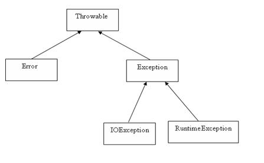

# 异常

## 异常是什么

异常是程序中的一些错误，但并不是所有的错误都是异常，并且错误有时候是可以避免的。

比如说，你的代码少了一个分号，那么运行出来结果是提示是错误 java.lang.Error；如果你用System.out.println(11/0)，那么你是因为你用0做了除数，会抛出 java.lang.ArithmeticException 的异常。

异常发生的原因有很多，通常包含以下几大类：

* 用户输入了非法数据。
* 要打开的文件不存在。
* 网络通信时连接中断，或者JVM内存溢出。

这些异常有的是因为用户错误引起，有的是程序错误引起的，还有其它一些是因为物理错误引起的。-
要理解Java异常处理是如何工作的，你需要掌握以下三种类型的异常：

* **检查性异常**：最具代表的检查性异常是用户错误或问题引起的异常，这是程序员无法预见的。例如要打开一个不存在文件时，一个异常就发生了，这些异常在编译时不能被简单地忽略。
* **运行时异常**： 运行时异常是可能被程序员避免的异常。与检查性异常相反，运行时异常可以在编译时被忽略。
* **错误**： 错误不是异常，而是脱离程序员控制的问题。错误在代码中通常被忽略。例如，当栈溢出时，一个错误就发生了，它们在编译也检查不到的。

## Exception 类的层次



## 捕获异常

```
try
{
   // 程序代码
}catch(异常类型 e1)
{
   //Catch 块
}
```

```
try{
   // 程序代码
}catch(异常类型1 异常的变量名1){
  // 程序代码
}catch(异常类型2 异常的变量名2){
  // 程序代码
}catch(异常类型2 异常的变量名2){
  // 程序代码
}
```

```
try
{
   // 程序代码
}catch(异常类型 e1){
   //Catch 块//有finally代码块时，可以不写
}finally{
   // 程序代码//这块代码，不管程序是否出错都会运行
   //有catch代码块时，可以不写
 }
```

上面的代码段包含了 3 个 catch块。

可以在 try 语句后面添加任意数量的 catch 块。

如果保护代码中发生异常，异常被抛给第一个 catch 块。

如果抛出异常的数据类型与 ExceptionType1 匹配，它在这里就会被捕获。

如果不匹配，它会被传递给第二个 catch 块。

如此，直到异常被捕获或者通过所有的 catch 块

## throws/throw 关键字

```java
import java.io.*;
public class className{
  //方法上主动抛出异常
  public void deposit(double amount) throws RemoteException{
    // 方法内主动抛出异常
    throw new RemoteException();
  }
}
```

## 自定义异常

```java
//继承Exception自定义异常
public class MyException extends Exception {
    //传递数字>10抛出异常
    private int detail;

    public MyException(int a){
        this.detail = a;
    }

    @Override
    public String toString() {
        return "抛出异常>传递参数过大："+detail;
    }
}
```

```java
public class Test {

    //可能会存在异常的方法
    static  void  test(int a) throws MyException {
        System.out.println("传递的参数为"+a);
        if (a > 10) {
            throw new MyException(a);//抛出
        }
        System.out.println("OK");
    }

    public static void main(String[] args) {
        try{
            test(11);
        }catch (MyException e){
            System.out.println(e);
        }
    }
}

```