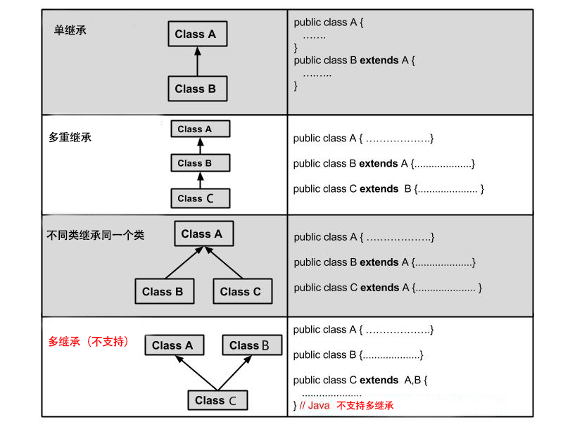

# 面向对象

## 什么是面向对象

* 面向过程
  * 步骤清晰简单，一步一步做
  * 适合处理简单的问题

* 面向对象
  * 物以类聚，**分类**的思维模式，先解决问题需要哪些分类，然后对这些分类进行单独思考，
  最后以面向过程的方法解决
  * 适合处理复杂的问题，多人协作
  
本质： 以类的方式组织代码，以对象的组织封装数据

* 特性：
  * 封装
  * 继承
  * 多态
  
## 类与对象的关系

* 使用new关键字创建对象

* 使用new创建对象时，除了分配内存空间外，会给创建好的对象进行默认初始化已经对类中构造器的调用

* 类的构造器也叫构造方法，是在创建对象时，必须调用的
  * 构造器必须和类名相同
  * 必须没有返回类型，也不写void
  
`Student`类

```java
package com.haer.oop;

//学生类
public class Student {
    //属性：字段
    public String name;
    public int age;

    //一个类什么都不写，默认带一个无参构造器
    //现在显示定义无参构造
    //new 的时候，就会调用构造器方法，一般用来初始化值
    public Student(){
        System.out.println("无参构造");
    }

    //有参构造
    //一旦定义了有参构造，无参构造就必须显示定义
     public Student(String name, int age) {
        this.name = name;
        this.age = age;
    }

    //方法
    public void study(){
        System.out.println(this.name);
    }

}

```

测试类

```java
package com.haer;

import com.haer.oop.Student;

public class test {
    public static void main(String[] args) {
        //类：抽象的，实例化
        //类实例化后会返回一个对象
        //student对象就是一个Student类的具体实例
        Student student1 = new Student();
        Student student2 = new Student();

        student1.name = "小明";
        student1.age = 20;
        System.out.println(student1.name);
        System.out.println(student1.age);
    }
}

```

## 封装

* 封装的优点

1. 良好的封装能够减少耦合。

2. 类内部的结构可以自由修改。

3. 可以对成员变量进行更精确的控制。

4. 隐藏信息，实现细节。

* 实现封装

修改属性的可见性来限制对属性的访问（一般限制为private），例如：

```java
public class Person {
    private String name;
    private int age;
}
```

这段代码中，将name和age属性设置为私有的，只能本类才能访问，其他类都访问不了，如此就对信息进行了隐藏（封装）。

那么需要给属性赋值或者获取值怎么办呢？

提供get set方法，用public修饰

```java
public class Person{
    private String name;
    private int age;
​
    public int getAge(){
      return age;
    }
​
    public String getName(){
      return name;
    }
​
    public void setAge(int age){
      this.age = age;
    }
​
    public void setName(String name){
      this.name = name;
    }
}
```

采用 this 关键字是为了解决实例变量（private String name）和局部变量（setName(String name)中的name变量）之间发生的同名的冲突。

## 继承

一个类下面可能包含多个类（例如人是一类，人具体也可以分为男生类，女生类）

* 类的继承格式

在 Java 中通过 extends 关键字可以申明一个类是从另外一个类继承而来的，一般形式如下：

```java
class 父类 {
}
 
class 子类 extends 父类 {
}
```

需要注意的是Java不支持多继承，但支持多重继承。



* 继承的特性

  * 子类拥有父类非 private 的属性、方法。

  * 子类可以拥有自己的属性和方法，即子类可以对父类进行扩展。

  * 子类可以用自己的方式实现父类的方法。

  * Java 的继承是单继承，但是可以多重继承，单继承就是一个子类只能继承一个父类，多重继承就是，例如 A 类继承 B 类，B 类继承 C 类，所以按照关系就是 C 类是 B 类的父类，B 类是 A 类的父类，这是 Java 继承区别于 C++ 继承的一个特性。

  * 提高了类之间的耦合性（继承的缺点，耦合度高就会造成代码之间的联系越紧密，代码独立性越差）。

* 继承关键字

继承可以使用`extends`和`implements`这两个关键字来实现继承，而且所有的类都是继承于 java.lang.Object，当一个类没有继承的两个关键字，则默认继承object（这个类在 java.lang 包中，所以不需要 import）祖先类。

**extends关键字**

在 Java 中，类的继承是单一继承，也就是说，一个子类只能拥有一个父类，所以 extends 只能继承一个类。

```java
public class Animal { 
    private String name;   
    private int id; 
    public Animal(String myName, String myid) { 
        //初始化属性值
    } 
    public void eat() {  
        //吃东西方法的具体实现  
    } 
    public void sleep() { 
        //睡觉方法的具体实现  
    } 
}
```
```java
public class Penguin  extends  Animal{ 
}
```
 
 

**implements关键字**

使用 implements 关键字可以变相的使java具有多继承的特性，使用范围为类继承接口的情况，可以同时继承多个接口（接口跟接口之间采用逗号分隔）。

```java
public interface A {
    public void eat();
    public void sleep();
}
 
public interface B {
    public void show();
}
 
public class C implements A,B {
}
```

**super 与 this 关键字**

super关键字：我们可以通过super关键字来实现对父类成员的访问，用来引用当前对象的父类。

this关键字：指向自己的引用。

```java
public class Animal {
  void eat() {
    System.out.println("animal : eat");
  }
}
```
```java
public class Dog extends Animal {
  void eat() {
    System.out.println("dog : eat");
  }
  void eatTest() {
    this.eat();   // this 调用自己的方法
    super.eat();  // super 调用父类方法
  }
}
```
```java
public class Test {
  public static void main(String[] args) {
    Animal a = new Animal();
    a.eat();
    Dog d = new Dog();
    d.eatTest();
  }
}
```

输出结果为：
```
animal : eat
dog : eat
animal : eat
```

**final关键字**

final 关键字声明类可以把类定义为不能继承的，即最终类；或者用于修饰方法，该方法不能被子类重写：

* 声明类：

```
final class 类名 {//类体}
```

* 声明方法：

```
修饰符(public/private/default/protected) final 返回值类型 方法名(){//方法体}
```

::: tip 注意
实例变量也可以被定义为 final，被定义为 final 的变量不能被修改。被声明为 final 类的方法自动地声明为 final，但是实例变量并不是 final
:::

**构造器**

子类是不继承父类的构造器（构造方法或者构造函数）的，它只是调用（隐式或显式）。如果父类的构造器带有参数，则必须在子类的构造器中显式地通过 super 关键字调用父类的构造器并配以适当的参数列表。

如果父类构造器没有参数，则在子类的构造器中不需要使用 super 关键字调用父类构造器，系统会自动调用父类的无参构造器。

```java
public class SuperClass {
  private int n;
  SuperClass(){
    System.out.println("SuperClass()");
  }
  SuperClass(int n) {
    System.out.println("SuperClass(int n)");
    this.n = n;
  }
}
```
```java
// SubClass 类继承
public class SubClass extends SuperClass{
  private int n;
  
  SubClass(){ // 自动调用父类的无参数构造器
    System.out.println("SubClass");
  }  
  
  public SubClass(int n){ 
    super(300);  // 调用父类中带有参数的构造器
    System.out.println("SubClass(int n):"+n);
    this.n = n;
  }
}
```
```java
// SubClass2 类继承
public class SubClass2 extends SuperClass{
  private int n;
  
  SubClass2(){
    super(300);  // 调用父类中带有参数的构造器
    System.out.println("SubClass2");
  }  
  
  public SubClass2(int n){ // 自动调用父类的无参数构造器
    System.out.println("SubClass2(int n):"+n);
    this.n = n;
  }
}
```
```java
public class TestSuperSub{
  public static void main (String args[]){
    System.out.println("------SubClass 类继承------");
    SubClass sc1 = new SubClass();
    SubClass sc2 = new SubClass(100); 
    System.out.println("------SubClass2 类继承------");
    SubClass2 sc3 = new SubClass2();
    SubClass2 sc4 = new SubClass2(200); 
  }
}
```

输出结果为：

```
------SubClass 类继承------
SuperClass()
SubClass
SuperClass(int n)
SubClass(int n):100
------SubClass2 类继承------
SuperClass(int n)
SubClass2
SuperClass()
SubClass2(int n):200
```

## 方法重写

```java
//方法重写都是方法的重写，与属性无关
public class B {

    public static void test(){
        System.out.println("B=>test");
    }
}
```
```java
public class A extends B {

    public static void test(){
        System.out.println("A=>test");
    }
}
```
```java
public class Test {
    public static void main(String[] args) {
        A a = new A();
        a.test();

        B b = new A();
        b.test();
    }
}
```

打印结果

```
A=>test
B=>test
```

将方法改为非静态方法

```java
//方法重写都是方法的重写，与属性无关
public class B {

    public void test(){
        System.out.println("B=>test");
    }
}
```
```java
public class A extends B {

    @Override//注解：重写
    public void test() {
//        super.test();
        System.out.println("A=>test");
    }
}
```
```java
public class Test {
    public static void main(String[] args) {
        //方法的调用只和左边，定义的数据类型有关
        A a = new A();
        a.test();

        //父类的引用指向子类
        B b = new A();
        b.test();
    }
}
```

打印结果

```
A=>test
A=>test
```

::: tip 注意
重写：需要有继承关系，子类重写父类方法

1、方法名必须相同

2、参数列表必须相同

3、修饰符：范围可以扩大但是不能变小

4、抛出的异常：范围可以缩小但是不能扩大
:::

## 多态

```java
public class Person {
    public void run(){
        System.out.println("person");
    }
}
```
```java
public class Student extends Person {
    //重写父类方法
    @Override
    public void run() {
        System.out.println("student");
    }

    public void eat(){
        System.out.println("eat");
    }
}
```
```java
public class Test {
    public static void main(String[] args) {

        //一个对象的实际类型都是确定的
        //new Student()
        //new Person()

        //可以指向的引用类型就不确定了：父类的引用指向子类
        Student student = new Student();
        //左边类代表，该对象能够调用的方法是在左边类中有的
        //右边是子类，若是俩个类都有的方法，如果子类重写了方法，就用子类的，否则调用父类的
        Person person = new Student();

        student.run();
        person.run();//因为Student重写了Person的run方法，所以都会调用Student的run方法

        student.eat();//子类可以调用独有的方法
        ((Student)person).eat();//父类不能直接调用子类独有方法,只能强制转换为Student类型调用
    }
}
```

打印结果

```
student
student
eat
eat
```

## instanceof

```java
public class Person {
}
```
```java
public class Student extends Person {
}
```
```java
public class Teacher extends Person{
}
```
```java
public class Test {
    public static void main(String[] args) {

        //x instanceof y：x与y必须存在父子关系，否则编译报错

        Object object = new Student();
        System.out.println(object instanceof Student);
        System.out.println(object instanceof Person);
        System.out.println(object instanceof Object);
        System.out.println(object instanceof Teacher);
        System.out.println(object instanceof String);
        System.out.println("==================");
        Person person = new Student();
        System.out.println(person instanceof Student);
        System.out.println(person instanceof Person);
        System.out.println(person instanceof Object);
        System.out.println(person instanceof Teacher);
//        System.out.println(person instanceof String);//编译报错
        System.out.println("==================");
        Student student = new Student();
        System.out.println(student instanceof Student);
        System.out.println(student instanceof Person);
        System.out.println(student instanceof Object);
//        System.out.println(student instanceof Teacher);//编译报错
//        System.out.println(student instanceof String);//编译报错
    }
}
```

打印结果

```
true
true
true
false
false
==================
true
true
true
false
==================
true
true
true
```

## static

```java
public class Student {
    private static int age;//静态变量
    private String name;//非静态变量

    public void run(){

    }

    public static void go(){

    }

    public static void main(String[] args) {
        System.out.println(Student.age);
//        System.out.println(Student.name);//无法通过类名调用非静态变量
        Student.go();
//        Student.run();//非静态方法不能直接调用
        Student student = new Student();
        System.out.println(student.age);
        System.out.println(student.name);//非静态变量只能通过new对象后，调用
        student.go();
        student.run();//非静态方法，需要拿到对象后调用
    }
}
```

```java
public class Person {
    {
        //优先构造器加载
        System.out.println("匿名代码块");
    }

    static {
        //最先加载
        //只会调用一次，和类一起加载
        System.out.println("静态代码块");
    }


    public Person() {
        System.out.println("构造器");
    }

    public static void main(String[] args) {
        Person person = new Person();
        System.out.println("========");
        Person person1 = new Person();
    }
}
```

输出结果

```
静态代码块
匿名代码块
构造器
========
匿名代码块
构造器
```

## 抽象类

```java
public abstract class Action {
    //抽象类不能被new出来
    //抽象方法必须在抽象类中
    public abstract void doSomething();

    public Action(){
        //c抽象类也是存在构造器
        //由子类实现
    }
    public void hello(){
        //抽象类可以写普通方法
    }
}
```

```java
public class A extends Action {
    @Override
    public void doSomething() {
        //A类继承了抽象类Action，那么必须重写Action的方法
        //除非A类也是抽象类，那么就由A的子类去重写方法
    }
}
```

## 接口

```java
//接口使用interface定义
public interface UserService {
    //接口定义的变量都是常量，前面默认public static final修饰符
    double PI = 3.14;
    //接口前面默认有public abstract修饰符
    void run(String name);
}
```
```java
//接口使用interface定义
public interface UserService2 {
    //接口前面默认有public abstract修饰符
    void go(String name);
}
```
```java
//类可以通过implements实现多个接口, 弥补了java不能多继承
public class UserServiceImpl implements UserService,UserService2 {
    public void run(String name) {
        //必须实现接口的方法
    }

    public void go(String name) {

    }
}
```

## 内部类

```java
public class Outer {
    private String OutName="外部名字";
    private static int id=1;
    public void out(){
        System.out.println("这是外部类的方法");
        //局部内部类
        class partInner{

        }
    }
    private void priOut(){
        System.out.println("这是外部类的私有方法");
    }
    private static  void priStaticOut(){
        System.out.println("这是外部类的私有静态方法");
    }

    //内部类
    public class Inner{
        private String inName= "内部名字";
        public void in(){
            System.out.println("这是内部类的方法");
        }

        //获得外部类的私有属性
        public void getOutId(){
            System.out.println(OutName);
            priOut();//调用外部内的私有方法
        }

    }

    //静态内部类,只能调用外部类静态的变量和方法
    public static class staticInner{
        public void getOutId(){
            System.out.println(id);
            priStaticOut();
        }

    }

}

//一个Class文件可以有多个class类，但只有有一个类被声明为public
class A{

}
```

```java
public class Test {
    public static void main(String[] args) {
        Outer outer = new Outer();
        //通过这个外部类来实例化内部类
        Outer.Inner inner = outer.new Inner();
        inner.in();
        inner.getOutId();
        //匿名内部类
        new Outer().out();
    }
}
```