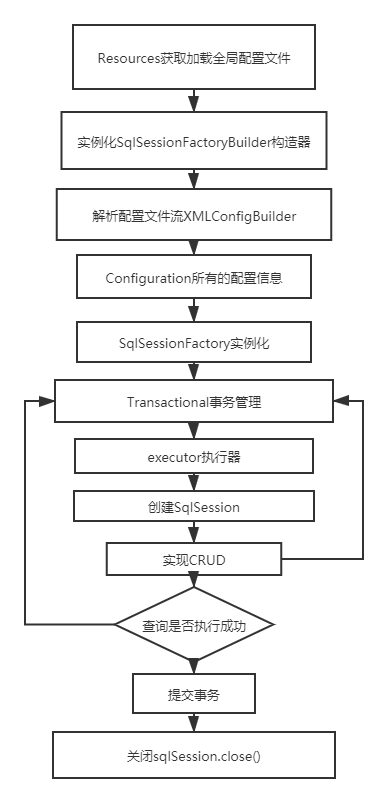

# 注解开发

## Mybatis流程



## 注解开发

可以在工具类创建时实现自动提交事务

```java
public class MybatisUtils {
    public static SqlSession getSqlSession() {
        return 
    }
}
```

舍去UserMapper.xml文件

Dao层

```java
public interface UserMapper {
    //查询全部
    @Select("select * from user")
    List<User> selectUserList();

    //根据id查询
    @Select("select * from user where id = #{id}")
    User selectUserById(@Param("id") int id);

    //新增
    @Insert("insert into mybatis.user (id, name, pwd) values (#{id}, #{name}, #{pwd})")
    int insertUser(User user);

    //修改
    @Update("update user set name = #{name}, pwd = #{pwd} where id = #{id}")
    int updateUser(User user);

    //删除
    @Delete("delete from user where id = #{id}")
    int deleteUser(@Param("id")int id);
}
```

mybatis-config.xml文件配置mapper，使用class

```xml
<configuration>
    <mappers>
        <mapper class="com.haer.dao.UserMapper"/>
    </mappers>
</configuration>
```

## @Param注解

* 基本数据类型的参数或者String类型，需要加上
* 引用类型不需要加
* 如果只有一个基本类型，可以不加，建议加
* 我们在Sql中引用的就是@Param()设置的属性名

## 区别#{}&${}

* #{}

能够很大程度防止sql注入(安全)

sql语句中#{}表示一个占位符即?,如果sql语句中只有**一个参数**，参数名称可以**随意定义**

* ${}

无法防止sql注入

$ {value}中value值有限制只能写对应的value值不能随便写，因为${}不会自动进行jdbc类型转换

如果需要在查询语句中 **动态指定表名**,就只能使用${}

```xml
<select>
      select *  from emp_ ${year}
</select>
```

再比如MyBatis **排序时使用**`order by` **动态参数**时,此时也只能使用${}

```xml
<select>
       select  *  from dept order by ${name}
</select>
```