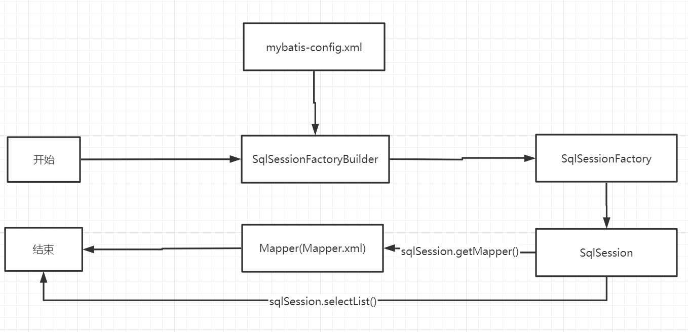

# 配置解析

## 核心配置文件

* mybatis-config.xml（名字可以自定义）

* MyBatis 的配置文件包含了会深深影响 MyBatis 行为的设置和属性信息

```
configuration（配置）
properties（属性）
settings（设置）
typeAliases（类型别名）
typeHandlers（类型处理器）
objectFactory（对象工厂）
plugins（插件）
environments（环境配置）
environment（环境变量）
transactionManager（事务管理器）
dataSource（数据源）
databaseIdProvider（数据库厂商标识）
mappers（映射器）
```

## 环境变量（environments）

* MyBatis 可以配置成适应多种环境

尽管可以配置多个环境，但每个 SqlSessionFactory 实例只能选择一种环境。

`default="development"`指定使用development环境

```xml
<environments default="development">
        <environment id="development">
            <transactionManager type="JDBC"/>
            <dataSource type="POOLED">
                <property name="driver" value="com.mysql.jdbc.Driver"/>
                <property name="url"
                          value="jdbc:mysql://localhost:3306/mybatis?useSSL=false&amp;useUnicode=true&amp;characterEncoding=utf-8"/>
                <property name="username" value="root"/>
                <property name="password" value="123456"/>
            </dataSource>
        </environment>
        <environment id="test">
            <transactionManager type="JDBC"/>
            <dataSource type="POOLED">
                <property name="driver" value="com.mysql.jdbc.Driver"/>
                <property name="url"
                          value="jdbc:mysql://localhost:3306/mybatis?useSSL=false&amp;useUnicode=true&amp;characterEncoding=utf-8"/>
                <property name="username" value="root"/>
                <property name="password" value="123456"/>
            </dataSource>
        </environment>
    </environments>
```

* MyBatis 中有两种类型的事务管理器`type="[JDBC|MANAGED]"`默认JDBC，另一种几乎不用

默认连接池POOLED

## 属性（properties）

我们可以通过properties属性来引用配置文件

这些属性可以在外部进行配置，并可以进行动态替换。你既可以在典型的 Java 属性文件中配置这些属性，
也可以在 properties 元素的子元素中设置

db.properties

```properties
driver=com.mysql.jdbc.Driver
url=jdbc:mysql://localhost:3306/mybatis?useSSL=false&useUnicode=true&characterEncoding=utf-8
username=root
password=123456
```

mybatis-config.xml

可以通过properties引入db.properties配置文件，也可以在内部使用property标签设置变量，配置文件优先级更大

```xml
<configuration>

    <properties resource="db.properties">
        <property name="username" value="root"/>
        <property name="password" value="111111"/>
    </properties>

    <environments default="development">
        <environment id="development">
            <transactionManager type="JDBC"/>
            <dataSource type="POOLED">
                <property name="driver" value="${driver}"/>
                <property name="url"
                          value="${url}"/>
                <property name="username" value="${username}"/>
                <property name="password" value="${password}"/>
            </dataSource>
        </environment>
    </environments>
    <mappers>
        <mapper resource="com/haer/dao/UserMapper.xml"/>
    </mappers>
</configuration>
```

## 类型别名（typeAliases）

* 类型别名是为Java类型设置一个短的名字

* 存在的意义仅在于用来减少类完全限定名的冗余

```xml
<typeAliases>
        <typeAlias type="com.haer.pojo.User" alias="User"/>
</typeAliases>
```

也可以指定一个包名，Mybatis会在包名下面搜索需要的JavaBean，比如：

扫描实体类的包，他的默认别名就是这个类的首字母小写

```xml
<typeAliases>
        <package name="com.haer.pojo"/>
</typeAliases>
```

设置包名后不能自定义别名，可以使用注解

```java
@Alias("user")
public class User {
    
}
```

## 设置（settings）

这是 MyBatis 中极为重要的调整设置，它们会改变 MyBatis 的运行时行为。

|设置名 |描述 | 有效值|默认值|
|-|-|-|-|
|logImpl	|指定 MyBatis 所用日志的具体实现，未指定时将自动查找。	|SLF4J \| LOG4J \| LOG4J2 \| JDK_LOGGING \| COMMONS_LOGGING \| STDOUT_LOGGING \| NO_LOGGING	|未设置|
|cacheEnabled	|全局性地开启或关闭所有映射器配置文件中已配置的任何缓存。	|true \| false	|true|
|lazyLoadingEnabled	|延迟加载的全局开关。当开启时，所有关联对象都会延迟加载。 特定关联关系中可通过设置 fetchType 属性来覆盖该项的开关状态。	|true \| false	|false|

## 映射器（mappers）

MapperRegistry:注册绑定Mapper文件

方式一：

```xml
<mappers>
        <mapper resource="com/haer/dao/UserMapper.xml"/>
</mappers>
```

方式二：

```xml
<mappers>
        <mapper class="com.haer.dao.UserMapper"/>
</mappers>
```

方式三：

```xml
<mappers>
        <mapper name="com.haer.dao"/>
</mappers>
```

::: tip 注意
方式二和方式三：Dao和Mapper必须同名且在同一包下
:::

## 作用域（Scope）和生命周期

不同作用域和生命周期类别是至关重要的，因为错误的使用会导致非常严重的**并发问题**



**SqlSessionFactoryBuilder**

* 一旦创建了 SqlSessionFactory，就不再需要它了
* 最佳作用域是方法作用域（也就是局部方法变量）

**SqlSessionFactory**

* 可以理解为 数据库连接池
* SqlSessionFactory 一旦被创建就应该在应用的运行期间一直存在，没有任何理由丢弃它或重新创建另一个实例
* SqlSessionFactory 的最佳作用域是应用作用域
* 最简单的就是使用**单例模式**或者静态单例模式

**SqlSession**

* 连接到连接池的一个请求
* SqlSession 的实例不是线程安全的，因此是不能被共享的，所以它的最佳的作用域是请求或方法作用域
* **用完后需要关闭**，否则占用资源


这里面每一个Mapper，就代表一个具体业务


