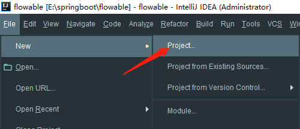
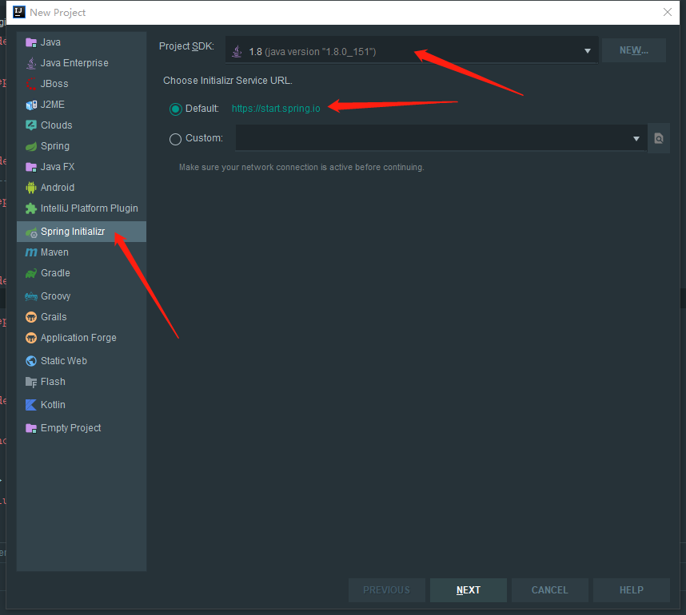
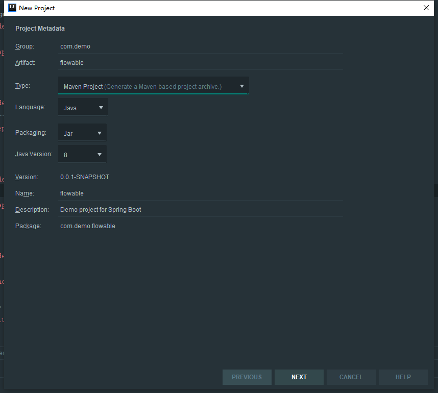
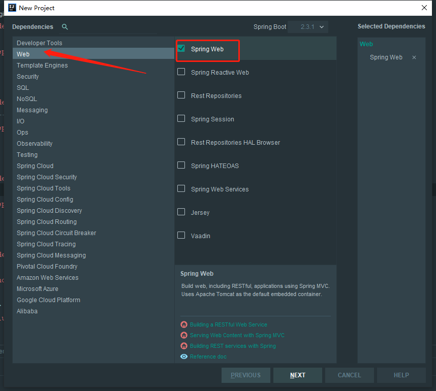
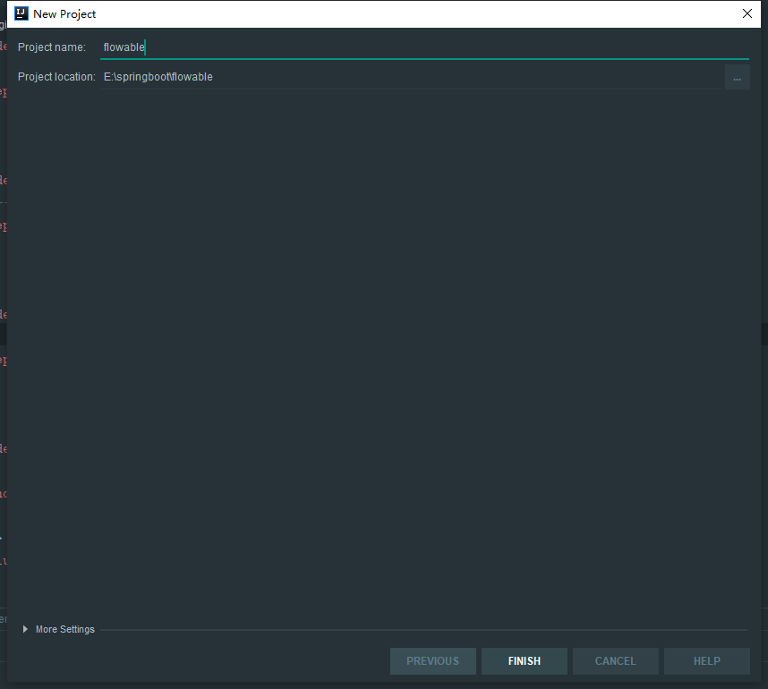

# 入门 - springBoot与flowable整合
## 环境
编码工具：IntelliJ IDEA 2019.1.3 x64

jdk环境：jdk1.8.0_151

maven环境：apache-maven-3.5.4

mysql：5.7

springBoot2.3.1与flowable6.5.0
## 创建新的springBoot项目并整合flowable
### 创建springBoot项目
1、打开idea新建一个项目


2、选择spring 初始化项目快速建立项目，选择jdk版本，这里选择的1.8，然后选择从官网拉去项目，这里需要有正常的网络连接



3、给项目命名，Java版本选择8



4、这里选择Spring Web就可以了



5、这里可以设置项目名称，点击完成，成功建立springBoot项目,恭喜你开始了第一步



### 整合flowable
1、pom文件代码配置properties与dependencies

```xml
    <properties>
        <java.version>1.8</java.version>
        <flowable.version>6.5.0</flowable.version>
    </properties>

    <dependencies>
        <dependency>
            <groupId>org.springframework.boot</groupId>
            <artifactId>spring-boot-starter-web</artifactId>
        </dependency>

        <dependency>
            <groupId>org.springframework.boot</groupId>
            <artifactId>spring-boot-starter-test</artifactId>
            <scope>test</scope>
            <exclusions>
                <exclusion>
                    <groupId>org.junit.vintage</groupId>
                    <artifactId>junit-vintage-engine</artifactId>
                </exclusion>
            </exclusions>
        </dependency>
        <!-- flowable依赖 -->
        <dependency>
            <groupId>org.flowable</groupId>
            <artifactId>flowable-spring-boot-starter</artifactId>
            <version>${flowable.version}</version>
        </dependency>
        <!-- mysql驱动-->
        <dependency>
            <groupId>mysql</groupId>
            <artifactId>mysql-connector-java</artifactId>
            <scope>runtime</scope>
        </dependency>
        <!--  阿里数据库连接池 -->
        <dependency>
            <groupId>com.alibaba</groupId>
            <artifactId>druid</artifactId>
            <version>1.1.21</version>
        </dependency>
    </dependencies>
```

2、resources下创建application.yml文件，url后必须配置nullCatalogMeansCurrent=true，mysql根据自己的情况去配置

```yaml
server:
  port: 8088

flowable:
  #关闭定时任务JOB
  async-executor-activate: false
  #  将databaseSchemaUpdate设置为true。当Flowable发现库与数据库表结构不一致时，会自动将数据库表结构升级至新版本。
  database-schema-update: true

spring:
  jackson:
    date-format: yyyy-MM-dd HH:mm:ss
    time-zone: GMT+8
  datasource:
    driver-class-name: com.mysql.cj.jdbc.Driver
    type: com.alibaba.druid.pool.DruidDataSource
    # 如果不加这个参数，建表会失败：nullCatalogMeansCurrent=true
    url: jdbc:mysql://localhost:3306/demo_flowable?characterEncoding=UTF-8&rewriteBatchedStatements=true&useSSL=false&allowPublicKeyRetrieval=true&serverTimezone=Asia/Shanghai&nullCatalogMeansCurrent=true
    username: root
    password: 123456
    druid:
      initial-size: 5
      max-active: 20
      max-pool-prepared-statement-per-connection-size: 20
      max-wait: 60000
      min-evictable-idle-time-millis: 300000
      min-idle: 5
      pool-prepared-statements: true
      test-on-borrow: false
      test-on-return: false
      test-while-idle: true
      time-between-eviction-runs-millis: 60000
      validation-query: SELECT 1 FROM DUAL
      max-idle: 4
```
3、建立config目录，然后再config下创建ProcessEngineConfig配置类，用来简单配置

```java
package com.demo.flowable.config;

import org.flowable.engine.ProcessEngineConfiguration;
import org.flowable.spring.SpringProcessEngineConfiguration;
import org.springframework.context.annotation.Bean;
import org.springframework.context.annotation.Configuration;
import org.springframework.jdbc.datasource.DataSourceTransactionManager;

import javax.sql.DataSource;

@Configuration
public class ProcessEngineConfig {

    /**
     * ProcessEngine 配置，其中DataSourceTransactionManager和DataSource自动注入
     * @param dataSourceTransactionManager
     * @param dataSource
     * @return
     */
    @Bean
    public SpringProcessEngineConfiguration springProcessEngineConfiguration(DataSourceTransactionManager dataSourceTransactionManager,DataSource dataSource) {
        SpringProcessEngineConfiguration springProcessEngineConfiguration = new SpringProcessEngineConfiguration();
        springProcessEngineConfiguration.setDataSource(dataSource);
        springProcessEngineConfiguration.setTransactionManager(dataSourceTransactionManager);

        //不添加此项配置，在没创建表时，会抛出FlowableWrongDbException异常
        springProcessEngineConfiguration.setDatabaseSchemaUpdate(ProcessEngineConfiguration.DB_SCHEMA_UPDATE_TRUE);
        return springProcessEngineConfiguration;
    }
}
```
然后就可以成功启动项目了，如果数据库没有流程的表，会创建表，数量根据flowable版本变动，恭喜你成功整合了flowable