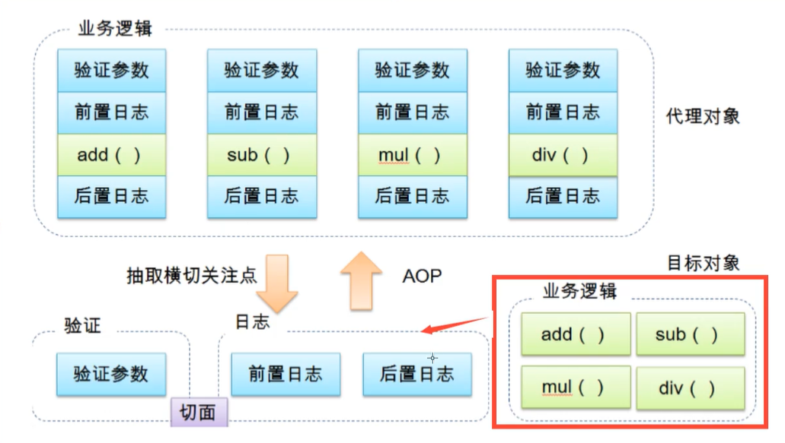
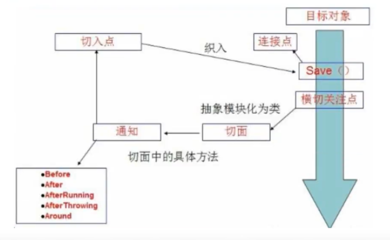

# AOP

## 什么是AOP

面向切面编程，通过预编译方式和运行期动态代理实现程序功能的统一维护的一种技术。AOP是OOP的延续
，是软件开发中的一个热点，也是Spring框架中的一个重要内容，是函数式编程的一种衍生范型，利用AOP
可以对业务逻辑的各个部分进行隔离，从而使得业务逻辑各部分之间得耦合度降低，提高程序得可重用性，
同时提供开发效率



## AOP在Spring中的作用

**提供声明式事务，允许用户自定义切面**

* 横切关注点：跨越应用程序多哥模块的方法或功能。即是，与我们业务逻辑无关的，但是我们需要
关注的部分，就是横切关注点。如日志，缓存，事务等。

* 切面（ASPECT）：横切关注点被模块化的特殊对象，即，它是一个类。

* 通知（Advice）：切面必须完成的工作。即，它是类中的一个方法

* 目标（Target）：被通知的对象。

* 代理（Proxy）：向目标对象应用通知之后创建的对象

* 切入点（PointCut）：切面通知执行的“地点”的定义

* 连接点（JoinPoint）：与切入点匹配的执行点。



SpringAOP中，通过Advice定义横切逻辑，Spring中支持五种类型的Advice

|通知类型 |连接点 |实现接口|
|-|-|-|
|前置通知   |方法前           |org.springframework.aop.MethodBeforeAdvice|
|后置通知   |方法后           |org.springframework.aop.AfterReturningAdvice|
|环绕通知   |方法前后         |org.aopalliance.intercept.MethodInterceptor|
|异常抛出通知|方法抛出异常      |org.springframework.aop.ThrowsAdvice|
|引介通知   |类中增加新的方法属性|org.springframework.aop.IntroductionInterceptor|

即，AOP在不改变原有代码的情况下，去增加新的功能

## 使用Spring实现AOP

【重点】使用AOP织入，需要导入一个依赖包

```xml
<!-- https://mvnrepository.com/artifact/org.aspectj/aspectjweaver -->
<dependency>
    <groupId>org.aspectj</groupId>
    <artifactId>aspectjweaver</artifactId>
    <version>1.9.6</version>
</dependency>
```

* **方式一：使用Spring的API接口**【主要SpringAPI接口实现】

`UserService`

```java
public interface UserService {
    void add();
    void delete();
    void update();
    void select();
}
```

`UserServiceImpl`

```java
public class UserServiceImpl implements UserService {
    public void add() {
        System.out.println("add");
    }

    public void delete() {
        System.out.println("delete");
    }

    public void update() {
        System.out.println("update");
    }

    public void select() {
        System.out.println("select");
    }
}
```

`Log`前置通知

```java
import org.springframework.aop.MethodBeforeAdvice;

import java.lang.reflect.Method;

public class Log implements MethodBeforeAdvice {

    //method:要执行的目标对象的方法
    //args：参数
    //target：目标对象
    public void before(Method method, Object[] args, Object target) throws Throwable {
        System.out.println(target.getClass().getName()+"的"+method.getName()+"执行了");
    }
}
```

AfterLog后置通知

```java
import org.springframework.aop.AfterReturningAdvice;

import java.lang.reflect.Method;

public class AfterLog implements AfterReturningAdvice{

    //returnValue:返回值
    public void afterReturning(Object returnValue, Method method, Object[] args, Object target) throws Throwable {
        System.out.println("执行了"+method.getName()+"方法，返回结果为："+returnValue);
    }
}
```

beans.xml

```xml
<?xml version="1.0" encoding="UTF-8"?>
<beans xmlns="http://www.springframework.org/schema/beans"
       xmlns:xsi="http://www.w3.org/2001/XMLSchema-instance"
       xmlns:aop="http://www.springframework.org/schema/aop"
       xsi:schemaLocation="http://www.springframework.org/schema/beans
        https://www.springframework.org/schema/beans/spring-beans.xsd
        http://www.springframework.org/schema/aop
        https://www.springframework.org/schema/aop/spring-aop.xsd">

<!--    注册bean-->
    <bean id="userService" class="com.haer.service.UserServiceImpl"/>
    <bean id="log" class="com.haer.log.Log"/>
    <bean id="afterLog" class="com.haer.log.AfterLog"/>

<!--    方式一：使用原生Spring API接口-->
<!--   配置aop：需要aop的约束-->
    <aop:config>
<!--        切入点:expression:表达式，execution(要执行的位置）-->
        <aop:pointcut id="poincut" expression="execution(* com.haer.service.UserServiceImpl.*(..))"/>

<!--        执行环绕增加-->
        <aop:advisor advice-ref="log" pointcut-ref="poincut"/>
        <aop:advisor advice-ref="afterLog" pointcut-ref="poincut"/>
    </aop:config>

</beans>
```

测试

```java
public class MyTest {

    @Test
    public void test(){
        ApplicationContext context = new ClassPathXmlApplicationContext("beans.xml");
        //动态代理的是接口
        UserService userService = context.getBean("userService", UserService.class);

        userService.add();
    }
}

```

控制台打印

```
com.haer.service.UserServiceImpl的add执行了
add
执行了add方法，返回结果为：null
```


* **方式二：自定义来实现AOP**【主要是切面定义】

DiyPoincut自定义切入点

```java
public class DiyPoincut {

    public void before(){
        System.out.println("方法执行前");
    }

    public void after(){
        System.out.println("方法执行后");
    }
}
```

beans.xml

```xml
<?xml version="1.0" encoding="UTF-8"?>
<beans xmlns="http://www.springframework.org/schema/beans"
       xmlns:xsi="http://www.w3.org/2001/XMLSchema-instance"
       xmlns:aop="http://www.springframework.org/schema/aop"
       xsi:schemaLocation="http://www.springframework.org/schema/beans
        https://www.springframework.org/schema/beans/spring-beans.xsd
        http://www.springframework.org/schema/aop
        https://www.springframework.org/schema/aop/spring-aop.xsd">

<!--    注册bean-->
    <bean id="userService" class="com.haer.service.UserServiceImpl"/>
    <bean id="diy" class="com.haer.diy.DiyPoincut"/>
    
    <aop:config>
        <aop:aspect ref="diy">
<!--            切入点-->
            <aop:pointcut id="point" expression="execution(* com.haer.service.UserServiceImpl.*(..))"/>
<!--            通知-->
            <aop:before method="before" pointcut-ref="point"/>
            <aop:after method="after" pointcut-ref="point"/>
        </aop:aspect>
    </aop:config>

</beans>
```

* 方式三：使用注解实现

AnnotationPointcut注解实现类

```java
import org.aspectj.lang.ProceedingJoinPoint;
import org.aspectj.lang.Signature;
import org.aspectj.lang.annotation.After;
import org.aspectj.lang.annotation.Around;
import org.aspectj.lang.annotation.Aspect;
import org.aspectj.lang.annotation.Before;

@Aspect//标注这个类是一个切面
public class AnnotationPointcut {

    @Before("execution(* com.haer.service.UserServiceImpl.*(..))")
    public void before(){
        System.out.println("方法执行前===");
    }

    @After("execution(* com.haer.service.UserServiceImpl.*(..))")
    public void after(){
        System.out.println("方法执行后===");
    }

    //在环绕增强中，我们可以给定一个参数，代表我们要获取处理切入的点
    @Around("execution(* com.haer.service.UserServiceImpl.*(..))")
    public void around(ProceedingJoinPoint joinPoint) throws Throwable {
        System.out.println("环绕前===");

        Signature signature = joinPoint.getSignature();//获得签名
        System.out.println("signature"+signature);
        //调用方法
        Object proceed = joinPoint.proceed();

        System.out.println("环绕后===");
    }
}
```

beans.xml

```xml
<?xml version="1.0" encoding="UTF-8"?>
<beans xmlns="http://www.springframework.org/schema/beans"
       xmlns:xsi="http://www.w3.org/2001/XMLSchema-instance"
       xmlns:aop="http://www.springframework.org/schema/aop"
       xsi:schemaLocation="http://www.springframework.org/schema/beans
        https://www.springframework.org/schema/beans/spring-beans.xsd
        http://www.springframework.org/schema/aop
        https://www.springframework.org/schema/aop/spring-aop.xsd">

<!--    注册bean-->
    <bean id="userService" class="com.haer.service.UserServiceImpl"/>

<!--    方式三：注解实现-->
    <bean id="annotationPointcut" class="com.haer.diy.AnnotationPointcut"/>
<!--    开启注解支持 proxy-target-class="false"默认false为JDK实现 true时为cglib实现-->
    <aop:aspectj-autoproxy proxy-target-class="false"/>

</beans>
```