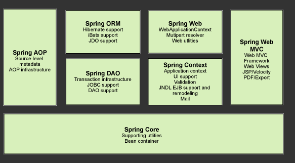

# 简介

* Spring：春天--->给软件行业带来了春天！
* 2002，首次推出Spring框架的雏形：interface21
* 2004年3月24日，发布Spring框架1.0正式版，即以interface21框架为基础，重新设计，并不断丰富其内涵
* **Rod Johnson**，Spring Framework创始人，是一位音乐学博士
* Spring理念： 使现有技术更加容易使用，本身是一个大杂烩，整合了现有技术框架

* SSH：Struct2+Spring+Hibernate
* SSM：SpringMvc+Spring+Mybatis

[Spring官网](https://spring.io/projects/spring-framework)

[官方下载地址](https://repo.spring.io/release/org/springframework/spring)

[GitHub](https://github.com/spring-projects/spring-framework)


```xml
<dependencys>
  <!-- https://mvnrepository.com/artifact/org.springframework/spring-webmvc -->
  <dependency>
    <groupId>org.springframework</groupId>
    <artifactId>spring-webmvc</artifactId>
    <version>5.2.8.RELEASE</version>
  </dependency>
<!-- 连接数据时使用的-->
  <dependency>
    <groupId>org.springframework</groupId>
    <artifactId>spring-jdbc</artifactId>
    <version>5.2.8.RELEASE</version>
  </dependency>
</dependencys>
```

## 优点

* Spring是一个开源的免费框架（容器）
* Spring是一个轻量级的，非侵入式的框架
* 控制反转（IOC），面向切面编程（AOP）
* 支持事务处理，对框架整合的支持

## 组成(了解)



* **核心容器（Spring Core）**

　　核心容器提供Spring框架的基本功能。Spring以bean的方式组织和管理Java应用中的各个组件及其关系。Spring使用BeanFactory来产生和管理Bean，它是工厂模式的实现。BeanFactory使用控制反转(IoC)模式将应用的配置和依赖性规范与实际的应用程序代码分开。

* **应用上下文（Spring Context）**

　　Spring上下文是一个配置文件，向Spring框架提供上下文信息。Spring上下文包括企业服务，如JNDI、EJB、电子邮件、国际化、校验和调度功能。

* **面向切面编程（Spring AOP**）

　　AOP(Aspect Oriented Programming)

　　通过配置管理特性，Spring AOP 模块直接将面向方面的编程功能集成到了 Spring框架中。所以，可以很容易地使 Spring框架管理的任何对象支持 AOP。Spring AOP 模块为基于 Spring 的应用程序中的对象提供了事务管理服务。通过使用 Spring AOP，不用依赖 EJB 组件，就可以将声明性事务管理集成到应用程序中。

* **JDBC和DAO模块（Spring DAO）**

　　JDBC、DAO的抽象层提供了有意义的异常层次结构，可用该结构来管理异常处理，和不同数据库供应商所抛出的错误信息。异常层次结构简化了错误处理，并且极大的降低了需要编写的代码数量，比如打开和关闭链接。

* **对象实体映射（Spring ORM**）

　　ORM(Object Relational Mapping)

　　Spring框架插入了若干个ORM框架，从而提供了ORM对象的关系工具，其中包括了Hibernate、JDO和 IBatis SQL Map等，所有这些都遵从Spring的通用事物和DAO异常层次结构。

* **Web模块（Spring Web）**

　　Web上下文模块建立在应用程序上下文模块之上，为基于web的应用程序提供了上下文。所以Spring框架支持与Struts集成，web模块还简化了处理多部分请求以及将请求参数绑定到域对象的工作。

* **MVC模块（Spring Web MVC）**

　　MVC(Model View Controller)

　　MVC框架是一个全功能的构建Web应用程序的MVC实现。通过策略接口，MVC框架变成为高度可配置的。MVC容纳了大量视图技术，其中包括JSP、POI等，模型来有JavaBean来构成，存放于m当中，而视图是一个街口，负责实现模型，控制器表示逻辑代码，由c的事情。Spring框架的功能可以用在任何J2EE服务器当中，大多数功能也适用于不受管理的环境。Spring的核心要点就是支持不绑定到特定J2EE服务的可重用业务和数据的访问的对象，毫无疑问这样的对象可以在不同的J2EE环境，独立应用程序和测试环境之间重用。

## 拓展

在Spring的官网中介绍：现代化的Java开发即基于Spring开发


* SpringBoot
  * 一个快速开发的脚手架
  * 基于SpringBoot可以快速的开发单个微服务
  * 约定大于配置
* SpringCloud
  * SpringCloud是基于SpringBoot实现的
  
是因为现在大多数在使用SpringBoot进行快速开发，学习SpringBoot的前提，需要完全掌握Spring及SpringMVC！承上启下的作用！

**弊端：发展时间长后，违背了原来的理念，配置十分繁琐，配置地狱！**
