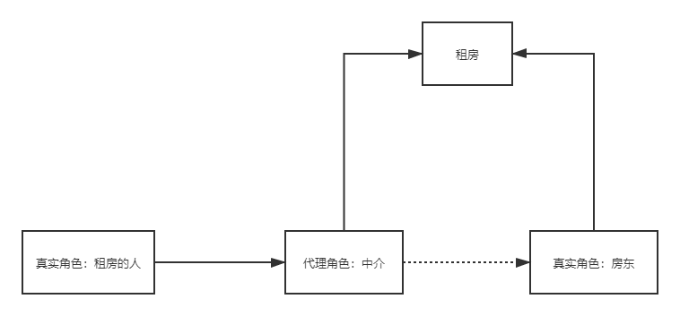

# 代理模式

为什么要学习代理模式？

因为这就是SpringAOP的底层

分为**静态代理**和**动态代理**



## 静态代理

角色分析：

* 抽象角色：一般使用接口会抽象类解决--租房
* 真实角色：被代理的角色--房东和租房的人
* 代理角色：代理真实对象，会在在这做一些附属操作
* 客户：访问代理对象的人

代码步骤：

接口：

```java
//租房
public interface Rent {

    void rent();
}
```

真实角色

```java
//房东
public class Host implements Rent {
    public void rent() {
        System.out.println("房东要出租房子");
    }
}
```

代理角色

```java
//中介
public class Proxy implements Rent{
    private Host host;

    public Proxy() {
    }

    public Proxy(Host host) {
        this.host = host;
    }

    public void rent() {
        seeHouse();
        host.rent();
        contract();
        fare();
    }

    //看房 
    public void seeHouse(){
        System.out.println("中介带你看房");
    }

    //签合同
    public void contract(){
        System.out.println("中介和你签合同");
    }

    //收中介费
    public void fare(){
        System.out.println("收中介费");
    }

}
```

客户端访问代理角色

```java
//客户
public class Client {
    @Test
    public void test1(){
        Host host = new Host();
        host.rent();
    }

    @Test
    public void test2(){
        //房东要出租房子
        Host host = new Host();
        //代理，中介帮房东租房，还会有些附属操作
        Proxy proxy = new Proxy(host);
        //你不用面对房东，直接找中介
        proxy.rent();
    }
}
```


代理模式的好处：

* 可以使真实角色操作更加纯粹，不用去关注一些公共业务
* 公共也就交给了代理角色,实现业务分工
* 公共业务发生扩展时，方便集中管理，比如扩展日志，就相当于这里代理角色中介的看房子，签合同，收中介费等附属操作

缺点：

* 一个真实角色就会产生一个代理角色，代码量翻倍


