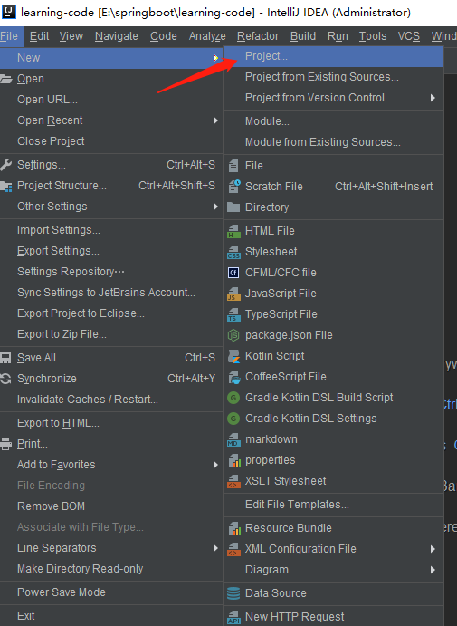
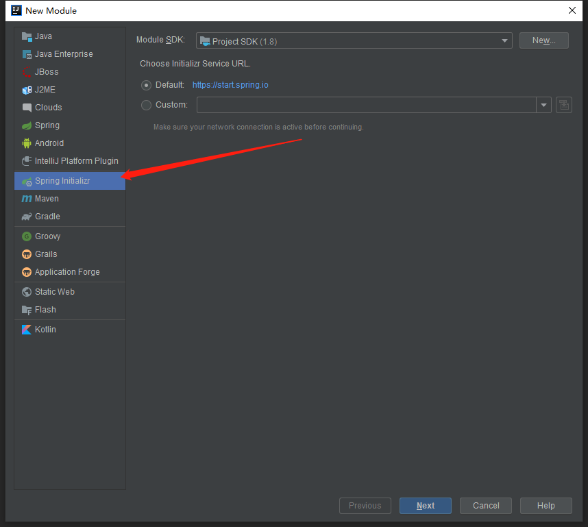
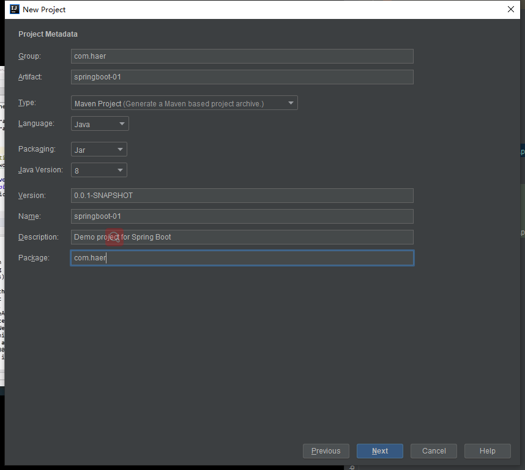
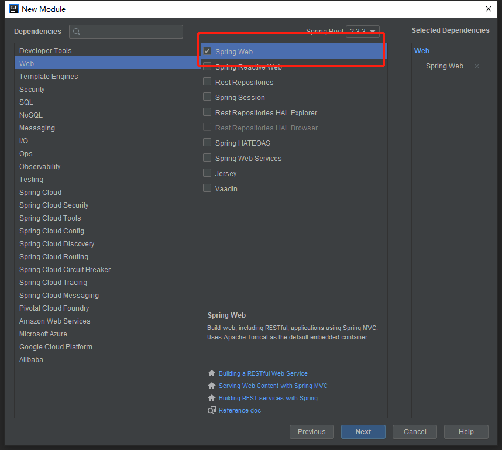
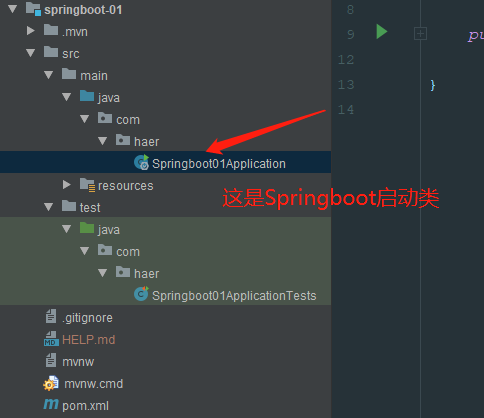

# HelloWorld

## IDEA快速创建









然后继续next，finish就可以了。

## 介绍及启动

这是项目结构，test中是测试使用的，在java中有一个Springboot启动类。



pom文件主要包含四个部分

* 项目元数据信息：创建项目时，输入的元数据，也就是Maven项目的基本元素，包括了groupId、artifactId、version、name、description等
* parent：继承了`spring-boot-starter-parent`的依赖管理，控制版本与打包内容
* dependencies：项目具体依赖，这里包含了`spring-boot-starter-web`用于实现HTTp接口（该依赖包含了SpringMVC），
官网描述是：使用SpringMVC构建Web（包括Restful）应用程序的入门者，使用Tomcat作为默认嵌入式容器；`spring-boot-starter-test`用于编写
单元测试的依赖
* build：构建配置部分，默认使用了`spring-boot-maven-plugin`，配合`spring-boot-starter-parent`就可以吧SpringBoot打包成jar来直接运行

```xml
<?xml version="1.0" encoding="UTF-8"?>
<project xmlns="http://maven.apache.org/POM/4.0.0" xmlns:xsi="http://www.w3.org/2001/XMLSchema-instance"
         xsi:schemaLocation="http://maven.apache.org/POM/4.0.0 https://maven.apache.org/xsd/maven-4.0.0.xsd">
    <modelVersion>4.0.0</modelVersion>
    <parent>
        <groupId>org.springframework.boot</groupId>
        <artifactId>spring-boot-starter-parent</artifactId>
        <version>2.3.3.RELEASE</version>
        <relativePath/> <!-- lookup parent from repository -->
    </parent>
    <groupId>com.haer</groupId>
    <artifactId>springboot-01</artifactId>
    <version>0.0.1-SNAPSHOT</version>
    <name>springboot-01</name>
    <description>Demo project for Spring Boot</description>

    <properties>
        <java.version>1.8</java.version>
    </properties>

    <dependencies>
<!--        web依赖：tomcat等-->
        <dependency>
            <groupId>org.springframework.boot</groupId>
            <artifactId>spring-boot-starter-web</artifactId>
        </dependency>

<!--        单元测试-->
        <dependency>
            <groupId>org.springframework.boot</groupId>
            <artifactId>spring-boot-starter-test</artifactId>
            <scope>test</scope>
            <exclusions>
                <exclusion>
                    <groupId>org.junit.vintage</groupId>
                    <artifactId>junit-vintage-engine</artifactId>
                </exclusion>
            </exclusions>
        </dependency>
    </dependencies>

    <build>
        <plugins>
            <plugin>
                <groupId>org.springframework.boot</groupId>
                <artifactId>spring-boot-maven-plugin</artifactId>
            </plugin>
        </plugins>
    </build>

</project>

```

在resources目录下有`application.properties`，习惯使用`application.yml`，可以修改为`application.yml`
在里面可以修改一下配置，如修改端口号

```yaml
server:
  port: 8081
```

我们在这个**启动类的同级目录**下，新建包controller，在包下新建HelloWorld类,
然后启动Springboot启动类，浏览器访问`http://localhost:8080/hello`，获得字符串helloWorld

```java
package com.haer.controller;

import org.springframework.web.bind.annotation.RequestMapping;
import org.springframework.web.bind.annotation.RestController;

@RestController
public class Helloworld {

    @RequestMapping("/hello")
    public String hello(){
        return "helloWorld";
    }
}

```

## banner

在resources目录下新建banner.txt，里面的内容会替代控制台打印的SpringBoot

```text
////////////////////////////////////////////////////////////////////
//                          _ooOoo_                               //
//                         o8888888o                              //
//                         88" . "88                              //
//                         (| ^_^ |)                              //
//                         O\  =  /O                              //
//                      ____/`---'\____                           //
//                    .'  \\|     |//  `.                         //
//                   /  \\|||  :  |||//  \                        //
//                  /  _||||| -:- |||||-  \                       //
//                  |   | \\\  -  /// |   |                       //
//                  | \_|  ''\---/''  |   |                       //
//                  \  .-\__  `-`  ___/-. /                       //
//                ___`. .'  /--.--\  `. . ___                     //
//              ."" '<  `.___\_<|>_/___.'  >'"".                  //
//            | | :  `- \`.;`\ _ /`;.`/ - ` : | |                 //
//            \  \ `-.   \_ __\ /__ _/   .-` /  /                 //
//      ========`-.____`-.___\_____/___.-`____.-'========         //
//                           `=---='                              //
//      ^^^^^^^^^^^^^^^^^^^^^^^^^^^^^^^^^^^^^^^^^^^^^^^^^^        //
//            佛祖保佑       永不宕机     永无BUG                    //
////////////////////////////////////////////////////////////////////
```

