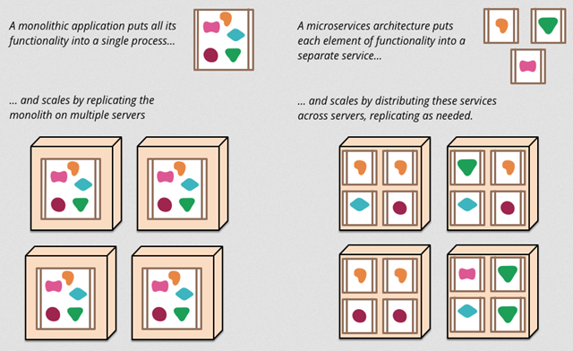
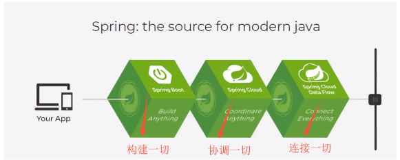

# 简介

## 回顾Spring

* 什么是Spring

Spring是一个开源框架，2003年兴起的一个轻量级的Java开发框架，作者：Rod Johnson

**Spring是为了解决企业级应用开发的复杂性而创建的，简化开发。**

* Spring是如何简化Java开发的

为了降低Java开发的复杂性，Spring采用了一下4种关键策略：

1、基于POJO的轻量级和最小侵入性编程；

2、通过IOC，依赖注入（DI）和面向接口实现松耦合；

3、基于切面（AOP）和惯例进行声明式编程；

4、通过切面和模板减少样式代码；

## 什么是SpringBoot

我们知道javaWeb的开发十分繁琐，SpringBoot呢，就是一个javaWeb的开发框架，和SpringMVC类似，对比其他javaWeb框架的好处：
官方描述的是简化开发、约定大于配置，you can 'just run'，能迅速的开发Web应用，几行代码开发一个http接口

Java企业级应用->J2EE->Spring->SpringBoot的过程都是为了提高开发效率，提倡“约定大于配置"

随着Spring的发展，涉及领域越来越多，变得没那么简单易用了，违背了最初的理念，需要很多的配置，俗称“配置地狱”。
SpringBoot正是在这样的背景下呗抽象出来的开发框架，目的就是让大家更容易的使用Spring、集成各种常用的中间件、开源软件。

SpringBoot基于Spring开发，SpringBoot本身并不提供Spring框架的核心特性以及扩展功能，只用于快速开发新一代基于Spring框架的应用程序。
并不是替代Spring的解决方案，而是和Spring框架紧密结合用于提升Spring开发者体验的工具。SpringBoot以**约定大于配置的核心思想**，
默认帮我们进行了很多设置，多数的SpringBoot应用只需要很少的Spring配置。同时它集成了大量常用的第三方库配置（Redis、MongoDB、Jpa等），
SpringBoot应用中这些第三方库几乎可以零配置的开箱即用。

简单来说就是SpringBoot不是新框架，只是默认配置了很多框架的使用方式

**SpringBoot的主要优点：**

* 为所有Spring开发者更快入门
* 开箱即用，提供各种默认配置来简化项目配置
* 内嵌式容器简化Web项目
* 没有冗余代码生产和XML配置的要求

## 微服务

* **什么是微服务**

微服务是一种架构分格，要求我们在开发一个应用时，这个应用必须构建成一系列小服务的组合，可以通过http的方式进行互通。要说微服务架构，得先了解单体应用架构

* **单体应用架构**

所谓单体应用架构（all is one）是指，我们将一个应用中的所有应用服务都封装在一个应用中

无论是什么系统，都把数据库访问、web访问等各个功能都放到一个war包中

好处：易于开发和测试，方便部署，扩展时，也只需要将war复制多份后，放到多个服务器，做个负载均衡

缺点：修改一个非常小的地方，就需要停掉整个服务。而且对于大型应用来说，如何维护、分工合作都是问题

* **微服务架构**

就是打破all is one的架构方式，把每个功能元素独立出来。把独立出来的功能元素动态组合，把需要的功能元素灵活的组合起来，所以微服务架构是对功能元素的复制，
而不是对整个应用。

好处：节省调用资源、每个功能元素的服务都是一个可替换的、可独立升级的软件代码。

Martin Fowler于2014年3月25日写的《Microservices》，阐述了什么是微服务。

[原文地址](http://martinfowler.com/articles/microservices.html)

[译文](https://www.cnblogs.com/liuning8023/p/4493156.html)

* **如何构建微服务**

一个大型系统的微服务架构，就像一个复杂交织的神经网络，每一个神经元就是一个功能元素，它们各自完成自己的功能，然后通过http互相请求调用。比如一个电商系统，
查缓存、连接数据库、浏览页面、结账、支付等都是一个个独立的功能服务，都被微化了，它们作为一个个微服务共同构建一个庞大的系统。需要修改一个功能，只需要去
修改其中一个功能服务单元

但是这种庞大的系统架构给部署和运维带来很大的难度。于是，Spring为我们带来了构建大型分布式微服务的全套、全程产品：

  * 构建一个个功能独立的微服务应用单元，可以使用SpringBoot快速构建一个应用
  * 大型分布式网络服务的调用，这部分由SpringCloud来完成，实现分布式
  * 在分布式中，进行流式数据计算、批处理、我们有Spring Cloud Data Flow
  * Spring为我们想清楚了整个从开始构建应用到大型分布式应用的全流程方案
  

  