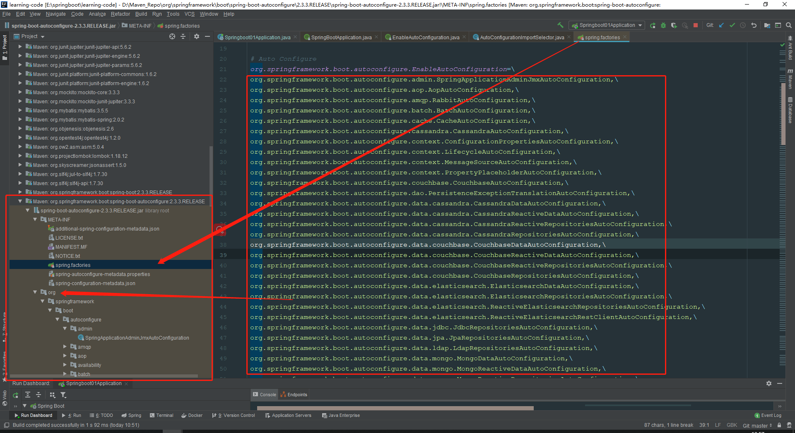
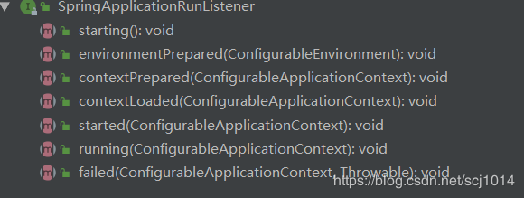

# 原理初探

自动配置：

## pom.xml

* 在`spring-boot-starter-parent`中，发现里面已经帮我们做了资源过滤

```xml
<resources>
      <resource>
        <directory>${basedir}/src/main/resources</directory>
        <filtering>true</filtering>
        <includes>
          <include>**/application*.yml</include>
          <include>**/application*.yaml</include>
          <include>**/application*.properties</include>
        </includes>
      </resource>
      <resource>
        <directory>${basedir}/src/main/resources</directory>
        <excludes>
          <exclude>**/application*.yml</exclude>
          <exclude>**/application*.yaml</exclude>
          <exclude>**/application*.properties</exclude>
        </excludes>
      </resource>
    </resources>
```

* 在`spring-boot-starter-parent`中有一个`spring-boot-dependencies`，发现里面的`properties`标签中有大量的控制版本的信息，
所以很多都不需要我们手动指定版本

```xml
<properties>
    <activemq.version>5.15.13</activemq.version>
    <antlr2.version>2.7.7</antlr2.version>
    <appengine-sdk.version>1.9.81</appengine-sdk.version>
    <artemis.version>2.12.0</artemis.version>
    <aspectj.version>1.9.6</aspectj.version>
    <assertj.version>3.16.1</assertj.version>
    <atomikos.version>4.0.6</atomikos.version>
    <awaitility.version>4.0.3</awaitility.version>
    <bitronix.version>2.1.4</bitronix.version>
    <build-helper-maven-plugin.version>3.1.0</build-helper-maven-plugin.version>
    <byte-buddy.version>1.10.14</byte-buddy.version>
    <caffeine.version>2.8.5</caffeine.version>
    <cassandra-driver.version>4.6.1</cassandra-driver.version>
    <classmate.version>1.5.1</classmate.version>
<!--.....还有很多。。。    -->
</properties>
```

## 启动器

```xml
<dependency>
   <groupId>org.springframework.boot</groupId>
   <artifactId>spring-boot-starter-xxx</artifactId>
</dependency>
```

* 启动器：说白了就是SpringBoot的启动场景
* 比如`spring-boot-starter-web`，它就会帮我们自动导入web环境的所有依赖
* SpringBoot会将所有功能场景，都变成一个个的启动器
* 我们要使用上面功能，只需要找到对应的启动器就可以了，可以去[官方文档](https://docs.spring.io/spring-boot/docs/current/reference/html/using-spring-boot.html#using-boot-starter)寻找

## 主程序

```java
@SpringBootApplication//标注这个类是一个SpringBoot的应用:启动类下的所有资源被导入
public class Springboot01Application {
    public static void main(String[] args) {
        //将SpringBoot应用启动
        SpringApplication.run(Springboot01Application.class, args);
    }
}
```

**注解**

> @SpringBootApplication：启动器注解介绍
>> @ComponentScan：扫描主启动类同级的包
>>> 
>> @SpringBootConfiguration：SpringBoot的配置
>>> @Configuration：Spring配置类  
>>>> @Component：说明这也是一个Spring的组件
>>
>> @EnableAutoConfiguration：自动配置
>>> @AutoConfigurationPackage：自动配置包
>>>> @Import(AutoConfigurationPackages.Registrar.class)：自动配置包注册，将@ComponentScan扫描的包在这里注册 
>>>> ```java
>>>> static class Registrar implements ImportBeanDefinitionRegistrar, DeterminableImports {
>>>>   //获得配置包元数据
>>>>   @Override
>>>>   public void registerBeanDefinitions(AnnotationMetadata metadata, BeanDefinitionRegistry registry) {
>>>>     register(registry, new PackageImports(metadata).getPackageNames().toArray(new String[0]));
>>>>   }
>>>>      
>>>>   @Override
>>>>   public Set<Object> determineImports(AnnotationMetadata metadata) {
>>>>     return Collections.singleton(new PackageImports(metadata));
>>>>   } 
>>>> }
>>>> ```       
>>> @Import(AutoConfigurationImportSelector.class)：自动配置导入选择
>>> ```java
>>> public class AutoConfigurationImportSelector implements DeferredImportSelector, BeanClassLoaderAware,
>>> 	ResourceLoaderAware, BeanFactoryAware, EnvironmentAware, Ordered {
>>>   //当前类加载器
>>>   private ClassLoader beanClassLoader;
>>>   //选择在pom.xml中配置的组件，加载元数据
>>>   @Override
>>>   public String[] selectImports(AnnotationMetadata annotationMetadata) {
>>> 	if (!isEnabled(annotationMetadata)) {
>>> 	  return NO_IMPORTS;
>>> 	}
>>> 	AutoConfigurationEntry autoConfigurationEntry = getAutoConfigurationEntry(annotationMetadata);
>>> 	return StringUtils.toStringArray(autoConfigurationEntry.getConfigurations());
>>>   }
>>>   //获得自动配置实体
>>>   protected AutoConfigurationEntry getAutoConfigurationEntry(AnnotationMetadata annotationMetadata) {
>>> 	if (!isEnabled(annotationMetadata)) {
>>> 	  return EMPTY_ENTRY;
>>> 	}
>>> 	AnnotationAttributes attributes = getAttributes(annotationMetadata);
>>> 	//获得所有配置
>>> 	List<String> configurations = getCandidateConfigurations(annotationMetadata, attributes);
>>> 	configurations = removeDuplicates(configurations);
>>> 	Set<String> exclusions = getExclusions(annotationMetadata, attributes);
>>> 	checkExcludedClasses(configurations, exclusions);
>>> 	configurations.removeAll(exclusions);
>>> 	configurations = getConfigurationClassFilter().filter(configurations);
>>> 	fireAutoConfigurationImportEvents(configurations, exclusions);
>>> 	return new AutoConfigurationEntry(configurations, exclusions);
>>>   }
>>>   //调用了此方法，获取候选的配置
>>>   protected List<String> getCandidateConfigurations(AnnotationMetadata metadata, AnnotationAttributes attributes) {
>>>     //调用加载工厂名称方法loadFactoryNames()
>>> 	List<String> configurations = SpringFactoriesLoader.loadFactoryNames(getSpringFactoriesLoaderFactoryClass(),
>>> 				getBeanClassLoader());
>>> 	//判断configurations不为空，后面是为空时，的报错信息。我们可以猜测自动配置包，是从META-INF/spring.factories拿到的
>>> 	Assert.notEmpty(configurations, "No auto configuration classes found in META-INF/spring.factories. If you "
>>> 			+ "are using a custom packaging, make sure that file is correct.");
>>> 	return configurations;
>>>   }
>>>  
>>>   protected Class<?> getSpringFactoriesLoaderFactoryClass() {
>>>     //获得标注了这个类的所有包和配置，上面启动类进去第二个注解就是@EnableAutoConfiguration，
>>>     // 也就是获取了主启动类
>>>  	return EnableAutoConfiguration.class;
>>>   }
>>>   //获取当前类加载器
>>>   protected ClassLoader getBeanClassLoader() {
>>>  	return this.beanClassLoader;
>>>   }
>>> }
>>> ```
>>> ```java
>>>  public final class SpringFactoriesLoader {
>>>    //前面猜测加载的是META-INF/spring.factories配置文件，确实是在这里加载了
>>>    public static final String FACTORIES_RESOURCE_LOCATION = "META-INF/spring.factories";
>>>    //获取所有的加载配置，factoryType：加载标注了@SpringBootApplication的启动类
>>>    public static List<String> loadFactoryNames(Class<?> factoryType, @Nullable ClassLoader classLoader) {
>>>      //获取类的名字
>>>      String factoryTypeName = factoryType.getName();
>>>      //Collections：获取默认的包名：判断不为空
>>>      return loadSpringFactories(classLoader).getOrDefault(factoryTypeName, Collections.emptyList());
>>>    }
>>> 
>>>    private static Map<String, List<String>> loadSpringFactories(@Nullable ClassLoader classLoader) {
>>>      MultiValueMap<String, String> result = cache.get(classLoader);
>>>      if (result != null) {
>>>      return result;
>>>      }
>>>      try {
>>>        //加载获取所有的项目资源和系统资源META-INF/spring.factories
>>>  	   Enumeration<URL> urls = (classLoader != null ?
>>>  			classLoader.getResources(FACTORIES_RESOURCE_LOCATION) :
>>>  			ClassLoader.getSystemResources(FACTORIES_RESOURCE_LOCATION));
>>>  	   result = new LinkedMultiValueMap<>();
>>>  	   //遍历了那些可以自动配置，hasMoreElements()：判断有没有更多的元素
>>>  	   while (urls.hasMoreElements()) {
>>>  	     //有的话就放到URL里面
>>>  	     URL url = urls.nextElement();
>>>  	     UrlResource resource = new UrlResource(url);
>>>  	     //把URL（所有的资源）加载到Properties配置类中，供我们使用
>>>  	     Properties properties = PropertiesLoaderUtils.loadProperties(resource);
>>>  	     for (Map.Entry<?, ?> entry : properties.entrySet()) {
>>>  	       String factoryTypeName = ((String) entry.getKey()).trim();
>>>  	       for (String factoryImplementationName : 
>>>                     StringUtils.commaDelimitedListToStringArray((String) entry.getValue())) {
>>>  	         //循环放到result
>>> 		     result.add(factoryTypeName, factoryImplementationName.trim());
>>>  	       }
>>>  	     }
>>>        }
>>>  	   //最后放到缓存中
>>>  	   cache.put(classLoader, result);
>>>  	   return result;
>>>      }catch (IOException ex) {
>>>        throw new IllegalArgumentException("Unable to load factories from location [" +
>>>  				FACTORIES_RESOURCE_LOCATION + "]", ex);
>>>      }
>>>    }
>>> }
>>> ```
>>> 找到`META-INF/spring.factories`，配置文件中配置126个`XXXAutoConfiguration`，都是SpringBoot帮我们自动配置的对应的类都在org目录下，比如Web的配置也是在里面
>>> 
>>> 那么导入了这么多的配置，为什么需要导入各种`starter-xxx`来实现配置呢！
>>> 随意进入一个配置类，也是上面org目录的各种配置类,发现都带有`@ConditionalOnXXX`的注解，去判断该自动配置是否生效。所以只有当你去导入`starter-xxx`是，才会是自动配置生效
>>> ```java
>>> @ConditionalOnProperty(prefix = "spring.application.admin", value = "enabled", havingValue = "true",
>>> 	matchIfMissing = false)
>>> public class SpringApplicationAdminJmxAutoConfiguration {
>>> //...
>>> }
>>> ```

::: tip 总结
SpringBoot所有自动配置都是在启动的时候扫描并加载`META-INF/spring.factories`配置文件，所有的配置类都在这里，但是不一定生效，
要判断条件是否成立，只要导入了对应的`starter`启动器，那么对应的自动配置就会生效，然后配置成功！

1、SpringBoot在启动的时候，从类路径下`META-INF/spring.factories`获取指定的值

2、将这些自动配置的类导入容器，自动配置就会生效，帮助我们配置，以前我们需要自己配置，但是现在也可以自定义配置

3、整合JavaEE，解决方案和自动配置的文件都在`spring-boot-autoconfigure-2.3.3.RELEASE.jar`这个包下

4、会把所有需要导入的组件，以类名的方式返回，这些组件就会被添加到容器中，存在非常多的`XXXAutoConfiguration`的文件（@Bean），
这些类给容器中导入了这个场景需要的所有组件，并自动配置(@Configuration)，免去了我们手动编写配置文件
:::

## Run

run方法开启了一个服务

```java
@SpringBootApplication
public class Springboot01Application {
    public static void main(String[] args) {
        //该方法返回了一个ConfigurableApplicationContext对象
        //参数1：应用入口的类（也就是本类），参数2：命令行参数
        SpringApplication.run(Springboot01Application.class, args);
    }

}
```

**SpringApplication**

这个类的作用:

* 推断应用的类型是普通的项目还是Web项目
* 查找并加载所有可用的初始化器，设置到initializers属性中
* 找出所有的应用程序监听器，设置到listeners属性中
* 推断并设置main方法的定义类，找到运行的主类

**查看构造器**

```java
public class SpringApplication {
    public SpringApplication(ResourceLoader resourceLoader, Class<?>... primarySources) {
        this.resourceLoader = resourceLoader;
		Assert.notNull(primarySources, "PrimarySources must not be null");
		this.primarySources = new LinkedHashSet<>(Arrays.asList(primarySources));
		this.webApplicationType = WebApplicationType.deduceFromClasspath();
		//监听初始化
		setInitializers((Collection) getSpringFactoriesInstances(ApplicationContextInitializer.class));
		//找出监听器
		setListeners((Collection) getSpringFactoriesInstances(ApplicationListener.class));
		this.mainApplicationClass = deduceMainApplicationClass();
	}
}
```

**RUN**

此处转载自[原文](https://blog.csdn.net/scj1014/article/details/90614104)，
以后有机会再来了解run方法具体实现

```java
public class SpringApplication {
    public ConfigurableApplicationContext run(String... args) {
    //<1>:
		StopWatch stopWatch = new StopWatch();
		stopWatch.start();
		ConfigurableApplicationContext context = null;
		Collection<SpringBootExceptionReporter> exceptionReporters = new ArrayList<>();
		configureHeadlessProperty();
		
	//<2>:
		SpringApplicationRunListeners listeners = getRunListeners(args);
		listeners.starting();
		
	//<3>:
		try {
			ApplicationArguments applicationArguments = new DefaultApplicationArguments(args);
	
	//<4>:
			ConfigurableEnvironment environment = prepareEnvironment(listeners, applicationArguments);
			configureIgnoreBeanInfo(environment);
			
	//<5>:
			Banner printedBanner = printBanner(environment);
			
	//<6>:
			context = createApplicationContext();
			exceptionReporters = getSpringFactoriesInstances(SpringBootExceptionReporter.class,
					new Class[] { ConfigurableApplicationContext.class }, context);
			
	//<7>:
			prepareContext(context, environment, listeners, applicationArguments, printedBanner);
			
	//<8>:
			refreshContext(context);
			
	//<9>:
			afterRefresh(context, applicationArguments);
			stopWatch.stop();
			if (this.logStartupInfo) {
				new StartupInfoLogger(this.mainApplicationClass).logStarted(getApplicationLog(), stopWatch);
			}
			
	//<10>:
			listeners.started(context);
			
	//<11>:
			callRunners(context, applicationArguments);
		}
		catch (Throwable ex) {
			handleRunFailure(context, ex, exceptionReporters, listeners);
			throw new IllegalStateException(ex);
		}

    //<12>:
		try {
			listeners.running(context);
		}
		catch (Throwable ex) {
			handleRunFailure(context, ex, exceptionReporters, null);
			throw new IllegalStateException(ex);
		}
		
	//<13>:
		return context;
	}
}
```

下面我们逐一分析：
<1> : `StopWatch stopWatch = new StopWatch();`

       `stopWatch.start();`

这段代码功能很简单，创建一个StopWatch对象，开始记录run()启动过程时长；

<2>: 先来看这个方法：`SpringApplicationRunListeners listeners = getRunListeners(args);`

```java
public class SpringApplication {
    private SpringApplicationRunListeners getRunListeners(String[] args) {
		Class<?>[] types = new Class<?>[] { SpringApplication.class, String[].class };
		return new SpringApplicationRunListeners(logger, getSpringFactoriesInstances(
				SpringApplicationRunListener.class, types, this, args));
    }
}
```


在这段代码里，我们又看见了熟悉的`getSpringFactoriesInstances()`,原理还是一样，就是`getSpringFactoriesInstances()`方法会从类路径下的
`META-INF/spring.factories`文件中找 对应`SpringApplicationRunListener`的全路径数组，并通过`createSpringFactoriesInstances()`
方法实例化成对象返回；

再看`listeners.starting()`方法：

```java
class SpringApplicationRunListeners {
     void starting() {
		for (SpringApplicationRunListener listener : this.listeners) {
			listener.starting();
		}
    }
}
```

所以这个方法就是回调之前获得的所有`SpringApplicationRunListener`对象的`starting()`方法,启动监听。我们可以继续再深入看一下这个监听对象的其他方法：

在这里插入图片描述



`SpringApplicationRunListener`接口中共有上面几个方法，这几个方法将会贯穿`run()`方法的运行。

<3>:这个方法的作用也很简单，封装命令行参数。

<4>: `ConfigurableEnvironment environment = prepareEnvironment(listeners, applicationArguments)`

其实这是环境准备阶段，我们可以看一下它的实现过程：

```java
public class SpringApplication {
    private ConfigurableEnvironment prepareEnvironment(
			SpringApplicationRunListeners listeners,
			ApplicationArguments applicationArguments) {
		// Create and configure the environment
		ConfigurableEnvironment environment = getOrCreateEnvironment();
		configureEnvironment(environment, applicationArguments.getSourceArgs());
		listeners.environmentPrepared(environment);
		bindToSpringApplication(environment);
		if (!this.isCustomEnvironment) {
			environment = new EnvironmentConverter(getClassLoader())
					.convertEnvironmentIfNecessary(environment, deduceEnvironmentClass());
		}
		ConfigurationPropertySources.attach(environment);
		return environment;
	}
}
```

这个方法表示创建环境，并且`environment`的属性都会加载进来，包括`application.properties`和外部的属性配置，具体实现有兴趣的同学可以研究一下。
其中`listeners.environmentPrepared(environment)`方法表示环境准备完成

<5>:功能为打印Banner，也可以自定义启动logo，比如在resources路径下创建一个banner.txt文件，将你想打印的图标放入其中

<6>:创建`ApplicationContext`容器，根据类型决定是创建普通WEB容器还是REACTIVE容器还是普通Annotation的ioc容器

<7>:`prepareContext(context, environment, listeners, applicationArguments, printedBanner);`

这个方法的具体实现：

```java
public class SpringApplication {
    private void prepareContext(ConfigurableApplicationContext context,
			ConfigurableEnvironment environment, SpringApplicationRunListeners listeners,
			ApplicationArguments applicationArguments, Banner printedBanner) {
		context.setEnvironment(environment);
		postProcessApplicationContext(context);
    //7.1:
		applyInitializers(context);
    //7.2:
		listeners.contextPrepared(context);
		if (this.logStartupInfo) {
			logStartupInfo(context.getParent() == null);
			logStartupProfileInfo(context);
		}
		// Add boot specific singleton beans
		ConfigurableListableBeanFactory beanFactory = context.getBeanFactory();
		beanFactory.registerSingleton("springApplicationArguments", applicationArguments);
		if (printedBanner != null) {
			beanFactory.registerSingleton("springBootBanner", printedBanner);
		}
		if (beanFactory instanceof DefaultListableBeanFactory) {
			((DefaultListableBeanFactory) beanFactory)
					.setAllowBeanDefinitionOverriding(this.allowBeanDefinitionOverriding);
		}
		// Load the sources
		Set<Object> sources = getAllSources();
		Assert.notEmpty(sources, "Sources must not be empty");
		load(context, sources.toArray(new Object[0]));
		listeners.contextLoaded(context);
	}
}
```

7.1: 从`initializers`集合中遍历所有的`ApplicationContextInitializer`，并通过`initializer.initialize()`方法初始化

7.2：回调`SpringApplicationRunListener`对象的`contextPrepared()`方法，表示容器已准备

<8>:`refreshContext(context)`

刷新容器，初始化ioc容器，向容器中加入配置类、组件，并且可以出发自动配置功能，具体原理可以参考SpringBoot的自动配置原理和Spring注解版容器的加载

<9>: `afterRefresh(context, applicationArguments);`

执行Spring容器初始化的后置处理，默认为空

```java
public class SpringApplication {
    protected void afterRefresh(ConfigurableApplicationContext context,
			ApplicationArguments args) {
	}
}
```


<10>: `listeners.started(context);`

回调所有的`SpringApplicationRunListener`对象的`started()`方法

<11>: `callRunners(context, applicationArguments)`

```java
public class SpringApplication {
    private void callRunners(ApplicationContext context, ApplicationArguments args) {
		List<Object> runners = new ArrayList<>();
		runners.addAll(context.getBeansOfType(ApplicationRunner.class).values());
		runners.addAll(context.getBeansOfType(CommandLineRunner.class).values());
		AnnotationAwareOrderComparator.sort(runners);
		for (Object runner : new LinkedHashSet<>(runners)) {
			if (runner instanceof ApplicationRunner) {
				callRunner((ApplicationRunner) runner, args);
			}
			if (runner instanceof CommandLineRunner) {
				callRunner((CommandLineRunner) runner, args);
			}
		}
	}
}
```

调用`ApplicationRunner`或者`CommandLineRunner`的运行方法，其中`ApplicationRunner`的优先级要比`CommandLineRunner`要高。
在我们日常的项目里，经常需要初始化一些资源，比如线程池或者数据库数据等，我们就可以实现这两个接口，在实现方法里写具体的处理逻辑，
也可以在实现类上加上`@Order(value)`注解来指定优先级(ps:该实现类要加上@Component)

<12>:`listeners.running(context);`

回调所有`SpringApplicationRunListener`对象的`running()`方法

<13>:`return context`返回容器