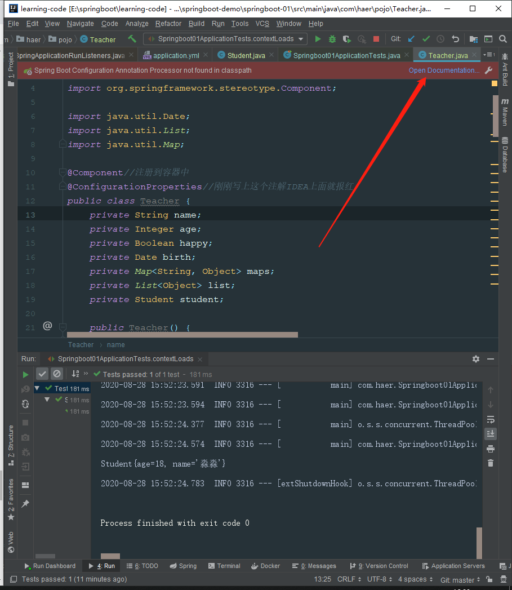
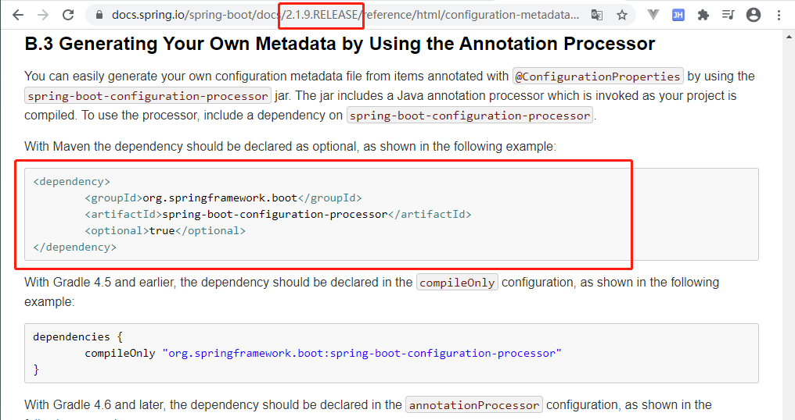
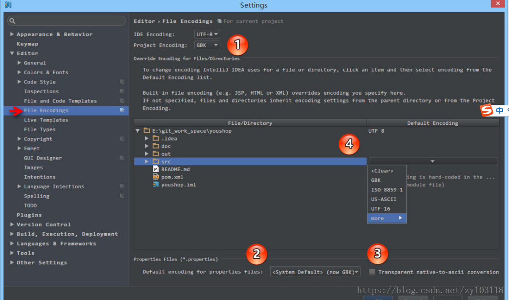

# yaml

## yaml语法学习

### 配置文件

SpringBoot使用一个全局的配置文件，配置文件名称是固定的

* application.properties

  * 语法结构 ：key=value

* application.yml

  * 语法结构 ：key：空格 value

配置文件的作用：修改SpringBoot自动配置的默认值，因为SpringBoot在底层都给我们自动配置好了；

比如我们可以在配置文件中修改Tomcat 默认启动的端口号

```properties
server.port=8081
```

或

```yaml
server:
  port: 8081
```

### yaml概述

YAML是 "YAML Ain't a Markup Language" （YAML不是一种标记语言），在开发的这种语言时，YAML 的意思其实是：
"Yet Another Markup Language"（仍是一种标记语言）

**这种语言以数据作为中心，而不是以标记语言为重点**

以前的配置文件，大多数都是使用xml来配置；比如一个简单的端口配置，我们来对比下yaml和xml

xml配置：

```xml
<server>
    <port>8081</port>
</server>
```

yaml配置

```yaml
server:
  port: 8081
```

### yaml基础语法

说明：语法要求严格！

1、空格不能省略

2、以缩进来控制层级关系，只要是左边对齐的一列数据都是同一个层级的。

3、属性和值的大小写都是十分敏感的。

值直接写在后面就可以，字符串默认不用加上双引号或者单引号；

```yaml
key: value
```

::: tip 注意
* “ ” 双引号，不会转义字符串里面的特殊字符，特殊字符会作为本身想表示的意思；

比如 ：name: "ha \n er"   输出 ：ha  换行   er

* '' 单引号，会转义特殊字符 ， 特殊字符最终会变成和普通字符一样输出

比如 ：name: ‘ha \n er’   输出 ：ha  \n   er
:::

## 给属性赋值

Student类

```java
@Component//注册到容器中
public class Student {
    @Value("18")
    private Integer age;
    @Value("淼淼")
    private String name;
    //无参构造、有参构造、get set方法、toString方法    
}
```

Teacher类

```java
@Component//注册到容器中
@ConfigurationProperties(prefix = "teacher")//刚刚写上这个注解IDEA上面就报红，添加依赖
@Validated//数据校验 JSR303
public class Teacher {
    @Email("请输入邮箱")//校验是否为邮箱 JSR303
    private String email;
    private String name;
    private Integer age;
    private Boolean happy;
    private Date birth;
    private Map<String, Object> maps;
    private List<Object> list;
    private Student student;
    //无参构造、有参构造、get set方法、toString方法    
}
```

刚刚加上`@ConfigurationProperties`IDEA报红色



，点进去，发现404界面，将版本号改为2.1.9，然后告诉我们需要导入依赖,不导入也不影响项目的运行



```xml
<dependency>
	<groupId>org.springframework.boot</groupId>
	<artifactId>spring-boot-configuration-processor</artifactId>
	<optional>true</optional>
</dependency>
```

application.yml

```yaml
teacher:
  name: 哈儿
  age: 3
  happy: true
  birth: 2000/03/20
  maps: {key1: value1,key2: value2}
  list:
    - code
    - girl
    - money
  student:
    name: 娇娇
    age: 20
```

测试

```java
@SpringBootTest
class Springboot01ApplicationTests {
    @Autowired
    private Student student;
    @Autowired
    private Teacher teacher;
    
    @Test
    void contextLoads() {
        System.out.println(student);
        System.out.println(teacher);
    }

}
```

控制台打印

```
Student{age=18, name='淼淼'}
Teacher{name='哈儿', age=3, happy=true, birth=Mon Mar 20 00:00:00 CST 2000, maps={key1=value1, key2=value2}, list=[code, girl, money], student=Student{age=20, name='娇娇'}
```

乱码解决方式



**回顾properties配置**

1、新建一个实体类User

```java
@Component //注册bean
public class User {
    private String name;
    private int age;
    private String sex;
}
```

2、编辑配置文件 user.properties

```properties
user1.name=哈儿
user1.age=20
user1.sex=男
```

3、我们在User类上使用@Value来进行注入！

```java
@Component //注册bean
@PropertySource(value = "classpath:user.properties")
public class User {
    //直接使用@value
    @Value("${user.name}") //从配置文件中取值
    private String name;
    @Value("#{9*2}")  // #{SPEL} Spring表达式
    private int age;
    @Value("男")  // 字面量
    private String sex;
}
```

4、Springboot测试

```java
@SpringBootTest
class DemoApplicationTests {

    @Autowired
    User user;

    @Test
    public void contextLoads() {
        System.out.println(user);
    }

}
```

成功获取值

```
User{name=哈儿, age=18, sex=男}
```

**对比**
||@ConfigurationProperties|@Value|
|-|-|-|
|功能|批量注入配置文件属性|一个个指定|
|松散绑定       |支持  |不支持|
|SpEL         |不支持 |支持  |
|JSR303数据校验 |支持  |不支持|
|复杂类型封装    |支持  |不支持|

## 多环境切换

profile是Spring对不同环境提供不同配置功能的支持，可以通过激活不同的环境版本，实现快速切换环境；

### 多配置文件

我们在主配置文件编写的时候，文件名可以是 application-{profile}.properties/yml , 用来指定多个环境版本；

**例如**：

application-test.properties 代表测试环境配置

application-dev.properties 代表开发环境配置

但是Springboot并不会直接启动这些配置文件，**它默认使用application.properties主配置文件；**

我们需要通过一个配置来选择需要激活的环境：

```properties
#比如在配置文件中指定使用dev环境，我们可以通过设置不同的端口号进行测试；
#我们启动SpringBoot，就可以看到已经切换到dev下的配置了；
spring.profiles.active=dev
```

### yaml的多文档块

和properties配置文件中一样，但是使用yml去实现不需要创建多个配置文件，更加方便了 !

```yaml
server:
  port: 8081
#选择要激活那个环境块
spring:
  profiles:
    active: prod

---
server:
  port: 8083
spring:
  profiles: dev #配置环境的名称


---

server:
  port: 8084
spring:
  profiles: prod  #配置环境的名称
```

::: tip 注意
如果yml和properties同时都配置了端口，并且没有激活其他环境 ， 默认会使用properties配置文件的！
:::

### 配置文件加载位置

**外部加载配置文件的方式十分多，我们选择最常用的即可，在开发的资源文件中进行配置！**

springboot 启动会扫描以下位置的application.properties或者application.yml文件作为Spring boot的默认配置文件：

```
优先级1：项目路径下的config文件夹配置文件
优先级2：项目路径下配置文件
优先级3：资源路径下的config文件夹配置文件
优先级4：资源路径下配置文件
```

优先级由高到底，高优先级的配置会覆盖低优先级的配置；

**SpringBoot会从这四个位置全部加载主配置文件；互补配置；**

我们在最低级的配置文件中设置一个项目访问路径的配置来测试互补问题；

```properties
#配置项目的访问路径
server.servlet.context-path=/haer
```

### 拓展，运维小技巧

指定位置加载配置文件

我们还可以通过spring.config.location来改变默认的配置文件位置

项目打包好以后，我们可以使用命令行参数的形式，启动项目的时候来指定配置文件的新位置；这种情况，一般是后期运维做的多，相同配置，外部指定的配置文件优先级最高

```
java -jar spring-boot-config.jar --spring.config.location=F:/application.properties
```
