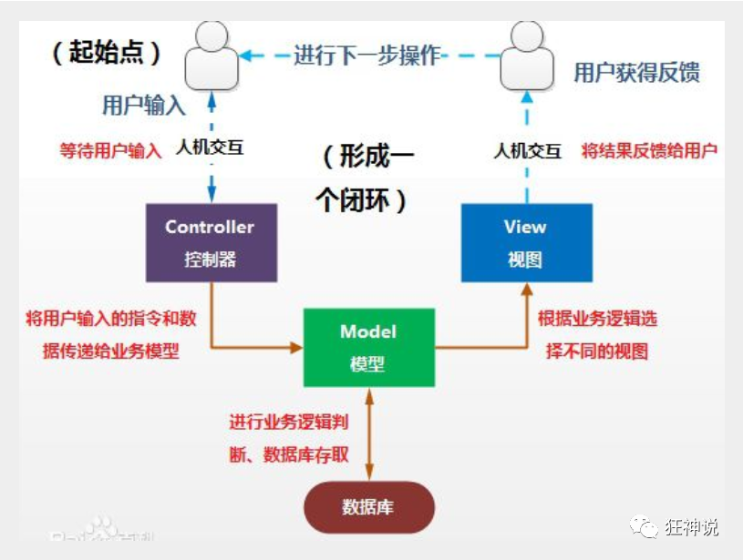
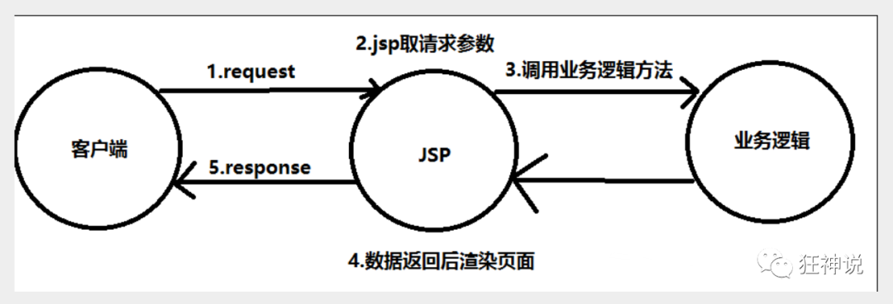
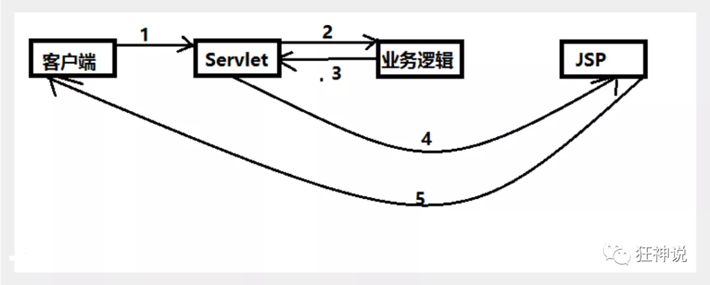
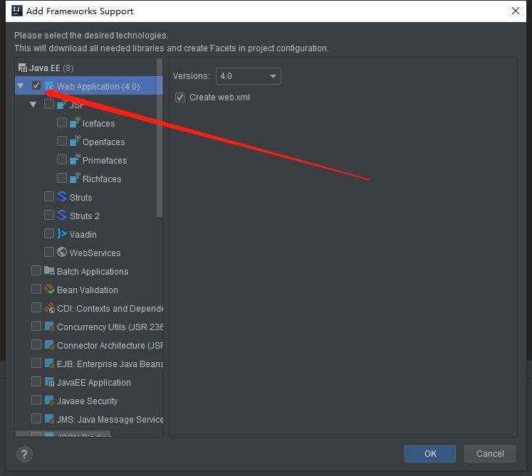
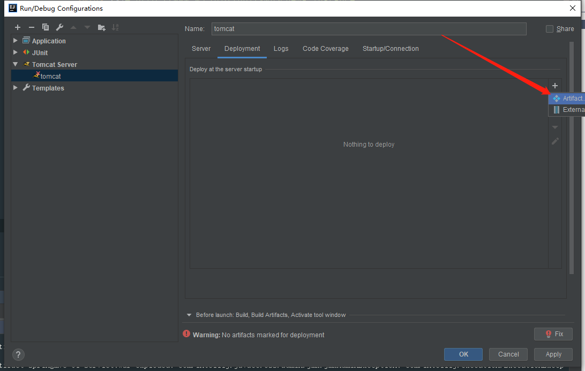

# 回顾

## 回顾MVC

### 什么是MVC

* MVC是模型(Model)、视图(View)、控制器(Controller)的简写，是一种软件设计规范。

* 是将业务逻辑、数据、显示分离的方法来组织代码。

* MVC主要作用是**降低了视图与业务逻辑间的双向偶合**。

* MVC不是一种设计模式，**MVC是一种架构模式**。当然不同的MVC存在差异。

**Model（模型）**：数据模型，提供要展示的数据，因此包含数据和行为，可以认为是领域模型或JavaBean组件（包含数据和行为），不过现在一般都分离开来：Value Object（数据Dao） 和 服务层（行为Service）。也就是模型提供了模型数据查询和模型数据的状态更新等功能，包括数据和业务。

**View（视图）**：负责进行模型的展示，一般就是我们见到的用户界面，客户想看到的东西。

**Controller（控制器）**：接收用户请求，委托给模型进行处理（状态改变），处理完毕后把返回的模型数据返回给视图，由视图负责展示。也就是说控制器做了个调度员的工作。

最典型的MVC就是JSP + servlet + javabean的模式。



### Model1时代

* 在web早期的开发中，通常采用的都是Model1。

* Model1中，主要分为两层，视图层和模型层。



Model1优点：架构简单，比较适合小型项目开发；

Model1缺点：JSP职责不单一，职责过重，不便于维护

### Model2时代

Model2把一个项目分成三部分，包括**视图、控制、模型**。



1、用户发请求

2、Servlet接收请求数据，并调用对应的业务逻辑方法

3、业务处理完毕，返回更新后的数据给servlet

4、servlet转向到JSP，由JSP来渲染页面

5、响应给前端更新后的页面

**职责分析：**

**Controller：控制器**

1、取得表单数据

2、调用业务逻辑

3、转向指定的页面

**Model：模型**

1、业务逻辑

2、保存数据的状态

**View：视图**

1、显示页面

Model2这样不仅提高的代码的复用率与项目的扩展性，且大大降低了项目的维护成本。Model 1模式的实现比较简单，
适用于快速开发小规模项目，Model1中JSP页面身兼View和Controller两种角色，将控制逻辑和表现逻辑混杂在一起，
从而导致代码的重用性非常低，增加了应用的扩展性和维护的难度。Model2消除了Model1的缺点。

## 回顾Servlet

首先[配置tomcat环境](../../tools/environment/tomcatEnvironment.md)，这里使用的idea

1、新建一个Maven工程当做父工程！pom依赖！

```xml
<dependencies>
   <dependency>
       <groupId>junit</groupId>
       <artifactId>junit</artifactId>
       <version>4.12</version>
   </dependency>
   <dependency>
       <groupId>org.springframework</groupId>
       <artifactId>spring-webmvc</artifactId>
       <version>5.1.9.RELEASE</version>
   </dependency>
   <dependency>
       <groupId>javax.servlet</groupId>
       <artifactId>servlet-api</artifactId>
       <version>2.5</version>
   </dependency>
   <dependency>
       <groupId>javax.servlet.jsp</groupId>
       <artifactId>jsp-api</artifactId>
       <version>2.2</version>
   </dependency>
   <dependency>
       <groupId>javax.servlet</groupId>
       <artifactId>jstl</artifactId>
       <version>1.2</version>
   </dependency>
</dependencies>
```

2、右击项目选择Add Framework Support...，添加Web app支持



3、编写一个Servlet类，用来处理用户的请求

```java
package com.haer.servlet;

import javax.servlet.ServletException;
import javax.servlet.http.HttpServlet;
import javax.servlet.http.HttpServletRequest;
import javax.servlet.http.HttpServletResponse;

public class HelloServlet extends HttpServlet {

    @Override
    protected void doGet(HttpServletRequest req, HttpServletResponse resp) throws ServletException, IOException {
        //取得参数
        String method = req.getParameter("method");
        if (method.equals("add")){
            req.getSession().setAttribute("msg","执行了add方法");
        }
        if (method.equals("delete")){
            req.getSession().setAttribute("msg","执行了delete方法");
        }
        //业务逻辑
        //视图跳转
        req.getRequestDispatcher("/WEB-INF/jsp/hello.jsp").forward(req,resp);
    }

    @Override
    protected void doPost(HttpServletRequest req, HttpServletResponse resp) throws ServletException, IOException {
        doGet(req,resp);
    }
}

```

4、在WEB-INF目录下新建一个jsp的文件夹，新建hello.jsp

```jsp
<%@ page contentType="text/html;charset=UTF-8" language="java" %>
<html>
<head>
    <title>Haer</title>
</head>
<body>
${msg}
</body>
</html>
```

5、在web.xml中注册Servlet

```xml
<?xml version="1.0" encoding="UTF-8"?>
<web-app xmlns="http://xmlns.jcp.org/xml/ns/javaee"
         xmlns:xsi="http://www.w3.org/2001/XMLSchema-instance"
         xsi:schemaLocation="http://xmlns.jcp.org/xml/ns/javaee http://xmlns.jcp.org/xml/ns/javaee/web-app_4_0.xsd"
         version="4.0">

    <servlet>
        <servlet-name>HelloServlet</servlet-name>
        <servlet-class>com.haer.servlet.HelloServlet</servlet-class>
    </servlet>
    <servlet-mapping>
        <servlet-name>HelloServlet</servlet-name>
        <url-pattern>/hello</url-pattern>
    </servlet-mapping>
<!--设置15分钟超时 -->
<!--    <session-config>-->
<!--        <session-timeout>15</session-timeout>-->
<!--    </session-config>-->
<!--    设置欢迎页-->
<!--    <welcome-file-list>-->
<!--        <welcome-file>index.jsp</welcome-file>-->
<!--    </welcome-file-list>-->
</web-app>
```

点击+号选择，到自己的项目，保存，然后启动Tomcat，测试



* localhost:8080/hello?method=add

* localhost:8080/hello?method=delete

**MVC框架要做哪些事情**

1、将url映射到java类或java类的方法

2、封装用户提交的数据

3、处理请求--调用相关的业务处理--封装响应数据

4、将响应的数据进行渲染 . jsp / html 等表示层数据

**说明**：

常见的服务器端MVC框架有：Struts、Spring MVC、ASP.NET MVC、Zend Framework、JSF；
常见前端MVC框架：vue、angularjs、react、backbone；
由MVC演化出了另外一些模式如：MVP、MVVM 等等....

