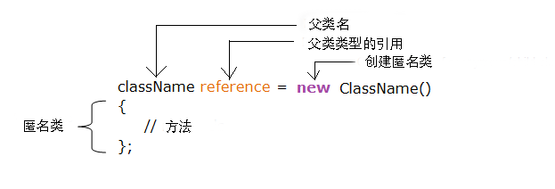

# Java 匿名类
[:leftwards_arrow_with_hook:Java 对象和类](./objectsAndClasses.html#源文件声明规则)

Java 中可以实现一个类中包含另外一个类，且不需要提供任何的类名直接实例化。

主要是用于在我们需要的时候创建一个对象来执行特定的任务，可以使代码更加简洁。

匿名类是不能有名字的类，它们不能被引用，只能在创建时用 new 语句来声明它们。

匿名类语法格式：
```java
class outerClass {

    // 定义一个匿名类
    object1 = new Type(parameterList) {
         // 匿名类代码
    };
}
```
以上的代码创建了一个匿名类对象 object1，匿名类是表达式形式定义的，所以末尾以分号 ; 来结束。

匿名类通常继承一个父类或实现一个接口。

## 匿名类继承一个父类
以下实例中，创建了 Polygon 类，该类只有一个方法 display()，AnonymousDemo 类继承了 Polygon 类并重写了 Polygon 类的 display() 方法
```java
class Polygon {
   public void display() {
      System.out.println("在 Polygon 类内部");
   }
}

class AnonymousDemo {
   public void createClass() {

      // 创建的匿名类继承了 Polygon 类
      Polygon p1 = new Polygon() {
         public void display() {
            System.out.println("在匿名类内部。");
         }
      };
      p1.display();
   }
}

class Main {
   public static void main(String[] args) {
       AnonymousDemo an = new AnonymousDemo();
       an.createClass();
   }
}
```
执行以上代码，匿名类的对象 p1 会被创建，该对象会调用匿名类的 display() 方法，输出结果为：`在匿名类内部。`
## 匿名类实现一个接口
以下实例创建的匿名类实现了 Polygon 接口：
```java
interface Polygon {
   public void display();
}

class AnonymousDemo {
   public void createClass() {

      // 匿名类实现一个接口
      Polygon p1 = new Polygon() {
         public void display() {
            System.out.println("在匿名类内部。");
         }
      };
      p1.display();
   }
}

class Main {
   public static void main(String[] args) {
      AnonymousDemo an = new AnonymousDemo();
      an.createClass();
   }
}
```
输出结果为：`在匿名类内部。`

[:leftwards_arrow_with_hook:Java 对象和类](./objectsAndClasses.html#源文件声明规则)
