# SVN的安装及使用
## 下载TortoiseSVN
  * 1.[官网下载地址](https://www.visualsvn.com/visualsvn/download/tortoisesvn/)
  
  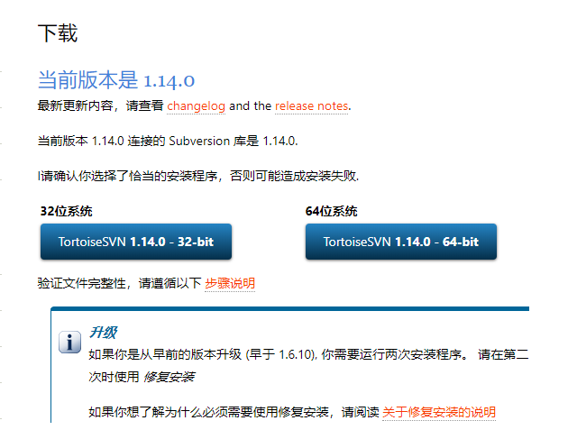
  
  * 2.[百度网盘](https://pan.baidu.com/s/1t4gnYVTYojX75Is4yM76OA)。提取码`g01j`
## 安装TortoiseSVN
 下载后双击打开，安装步骤
 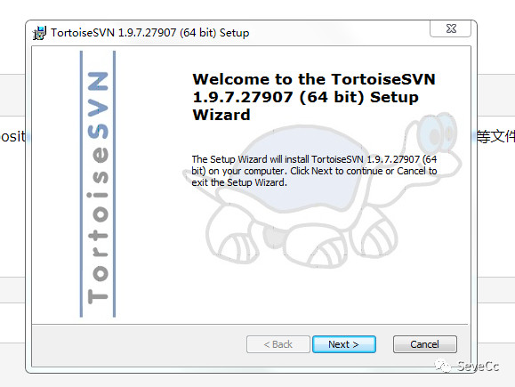
 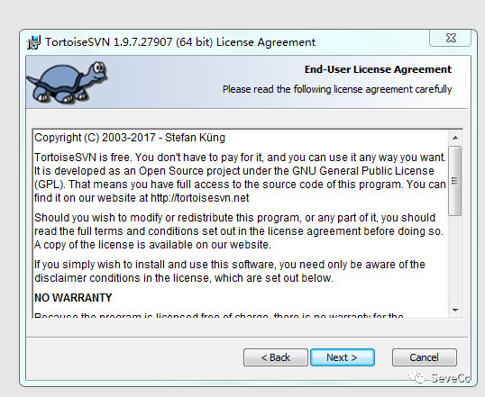
 
 此处需要勾选上，选择时，选择第二个，不然后面idea使用svn时可能找不到svn.exe，
 
 安装的地址自己选择(但是自己要能找到)
 
 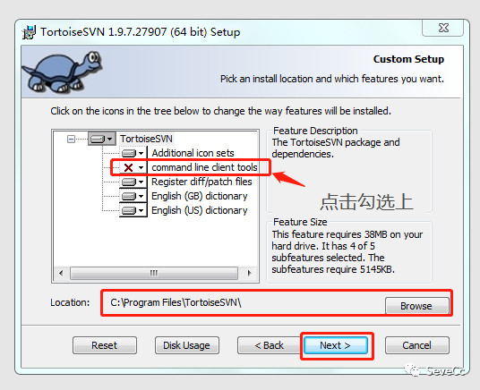
 
 后面点击next，Install即可
 
 * 汉化包下载
 
 上面的[网盘地址](https://pan.baidu.com/s/1t4gnYVTYojX75Is4yM76OA)提取码`g01j`
 也有或者进入[官网下载](http://tortoisesvn.net/downloads.html)
 
 选择下载简体或繁体，32位或64位，一直点击下一步，完成即可
 
 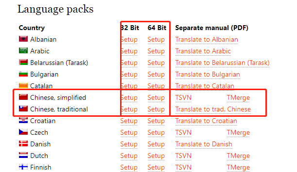
 
 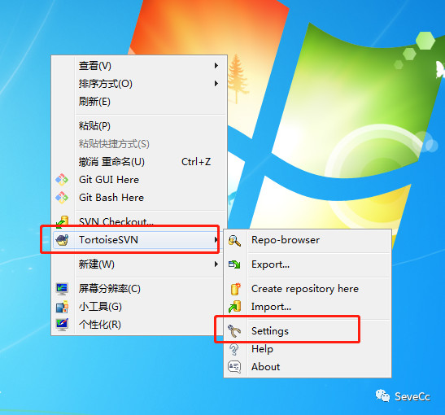
 
 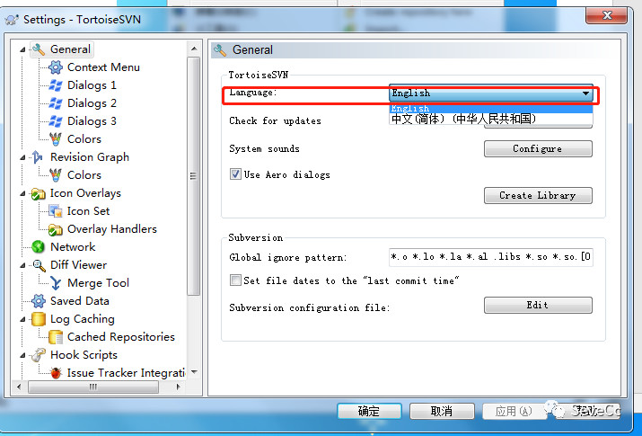
 
## 在idea中使用
 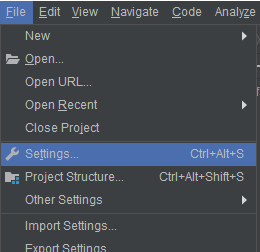
 
 找到安装地址bin目录下的svn.exe
 
 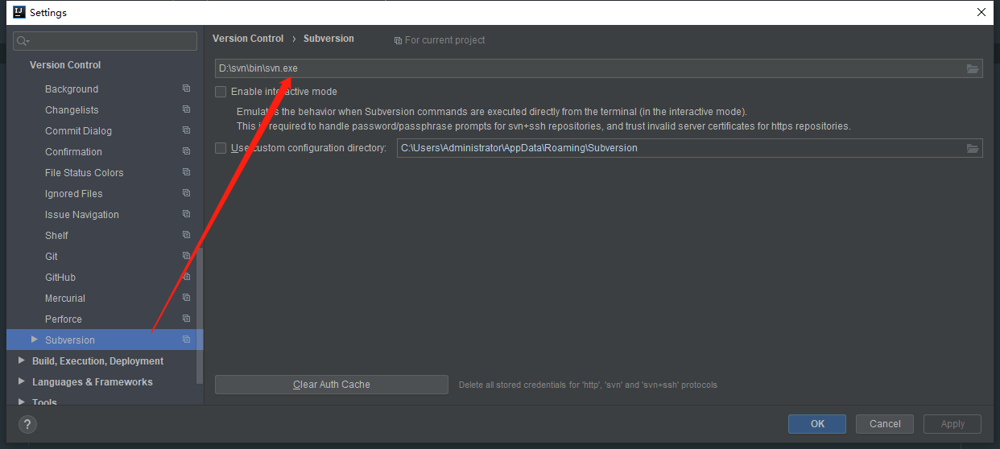
 
 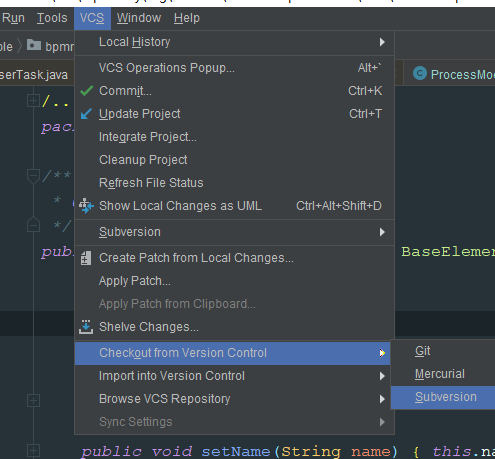
 
 点击+号即可输入代码地址管理代码
 
 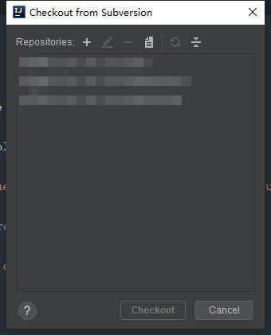
 
 
 
 