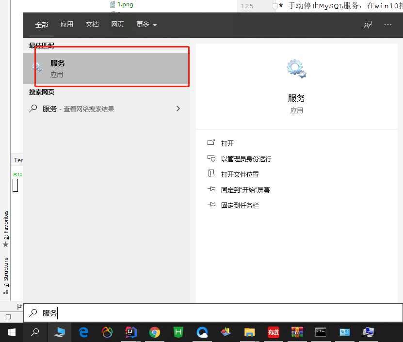
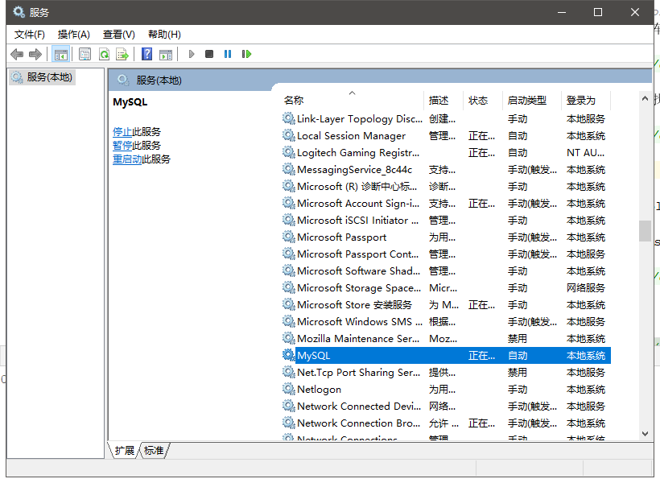

# Mysql5.7安装

## 下载

[官网](https://www.mysql.com)


这里选择64位下载


解压到指定目录，记住目录


## 配置环境变量

右击计算机->属性->高级系统设置->环境变量->系统变量


量名为：`MYSQL_HOME`，添加你的mysql-5.7.27-winx64文件夹所在位置


编辑Path，复制`%MYSQL_HOME%\bin`到原有值的后面，如图


## 配置my.ini文件

在你的mysql-5.7.27-winx64目录下新建my.ini文件，我的是在F:\MySql\mysql-5.7.30-winx64目录下新建，my.ini文件的内容为：

```ini
[mysqld]
#端口号
port = 3306
#mysql-5.7.27-winx64的路径
basedir=F:\MySql\mysql-5.7.30-winx64
#mysql-5.7.27-winx64的路径+\data
datadir=F:\MySql\mysql-5.7.30-winx64\data 
#最大连接数
max_connections=200
#编码
character-set-server=utf8

default-storage-engine=INNODB

sql_mode=NO_ENGINE_SUBSTITUTION,STRICT_TRANS_TABLES

[mysql]
#编码
default-character-set=utf8 
```


## 安装MySQL

在输入框内输入cmd，**以管理员的身份运行**，注意这里**必须要以管理员的身份运行**，
否则在安装过程中会出现因为管理权限不够而导致的**Install/Remove of the Service Denied!（安装/卸载服务被拒绝）**


在cmd中进入到F:\MySql\mysql-5.7.30-winx64\bin目录下


输入安装命令：`mysqld -install`，若出现**Service successfully installed**，证明安装成功；如出现**Install of the Service Denied**，则说明没有以管理员权限来运行cmd：


然后继续输入命令：`mysqld --initialize`，此时不会有任何提示：


再输入启动命令：`net start mysql`，出现以下提示证明MySQL启动成功：


## 设置MySQL密码

* 在这里设置密码主要是为了解决：**ERROR 1045 (28000): Access denied for user ‘root’@‘localhost’ (using password: NO)**的问题

* 首先停止MySQL服务,输入命令行`net stop mysql`


* 在E:\Program Files\Mysql\mysql-5.7.27-winx64目录下找到my.ini，在[mysqld]字段下任意一行添加`skip-grant-tables`,保存即可


* 重启MySQL,输入启动命令：`net start mysql`，出现以下提示证明MySQL启动成功


* 在输入命令`mysql -u root -p`，不需要输入密码，直接回车


* 输入命令行`use mysql`，进入数据库


* 输入命令行`update user set authentication_string=password("123456") where user="root";`**注意后面有分号**
  123456是你设置的新密码，root是用户名，敲击回车后若出现以下信息，证明修改成功！


* 手动停止MySQL服务，在win10搜索栏内输入服务，找到MySQL。点击右键，然后点击停止即可。





* 然后在刚刚的my.ini文件中删除`skip-grant-tables`这一行，保存关闭。

* 再次启动cmd（管理员身份），输入启动命令：`net start mysql`，再输入`mysql -u root -p`，再输入你刚刚设置的密码，出现以下信息证明设置成功！


* 然后输入命令行`use mysql`验证一下，结果报错：


* 既然没有重置密码，那就重置一下呗

  键入命令行`alter user user() identified by "123456";`密码自己设置，**注意分号**
  
  再次输入命令行`use mysql`验证一下，成功！
  


## 其他错误

1.[找不到my.ini文件](https://blog.csdn.net/baidu_41909653/article/details/82148455)

2.[ERROR 1045 (28000): Access denied for user ‘ODBC’@‘localhost’ (using password: NO)](https://blog.csdn.net/weixin_41688619/article/details/79879003)

3.[ERROR 1045 (28000): Access denied for user ‘ODBC’@‘localhost’ (using password: YES)](https://blog.csdn.net/weixin_41688619/article/details/79879003)

4.[Unknown column ‘password’ in ‘field list’](https://blog.csdn.net/u010603691/article/details/50379282)

5.[You must reset your password using ALTER USER statement before executing this statement](https://blog.csdn.net/hj7jay/article/details/65626766)
  
::: tip
[原文链接](https://blog.csdn.net/weixin_43395911/article/details/99702121)
:::


