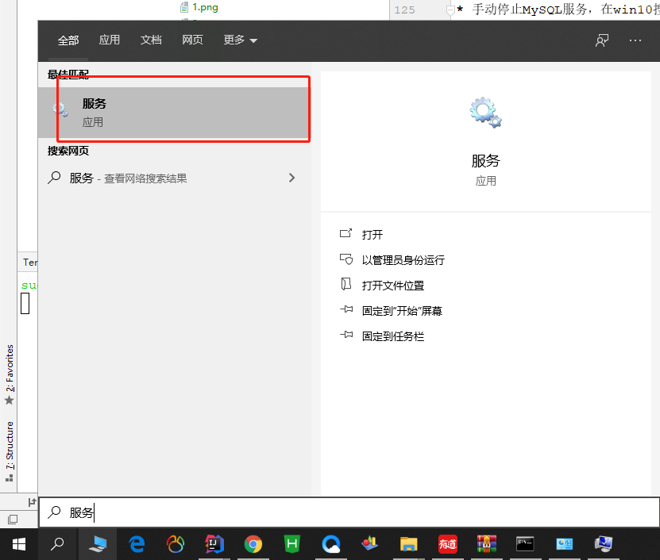
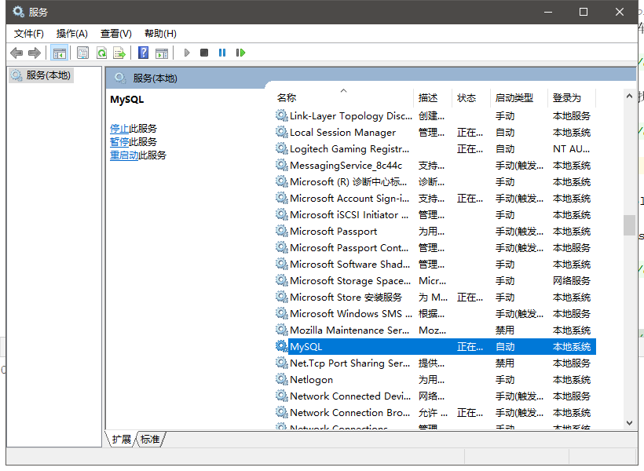
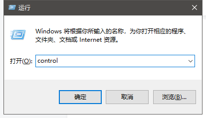
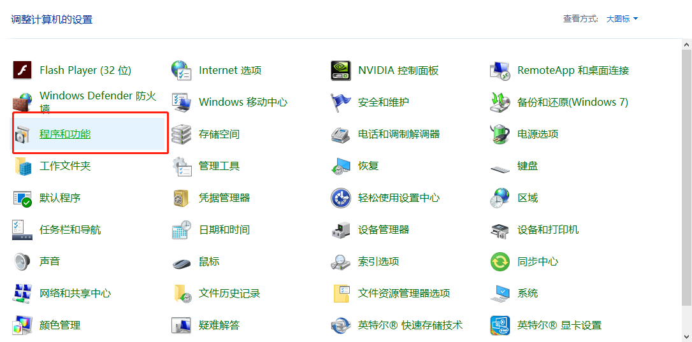
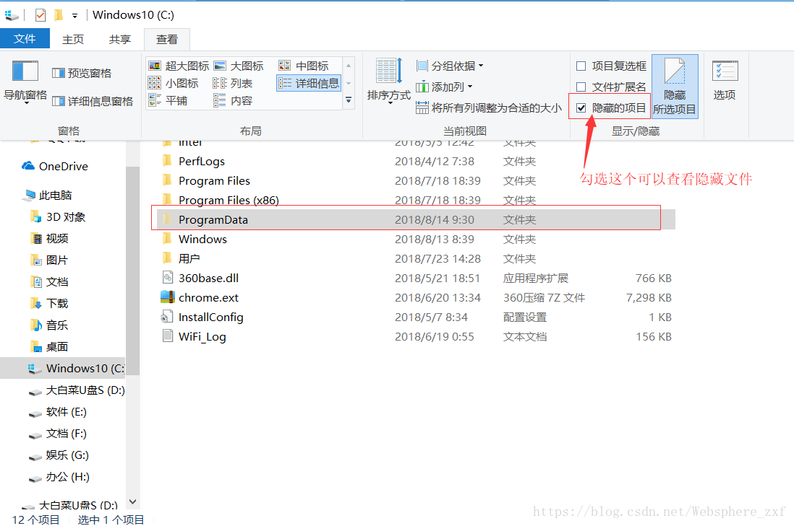

# 完整卸载Mysql

## 停止Mysql服务

手动停止MySQL服务，在win10搜索栏内输入服务，找到MySQL。点击右键，然后点击停止即可。

## 卸载mysql数据库

Win+R 键入control，进入控制面板->程序与功能找到Mysql相关卸载

## 删除mysql数据库残留文件

位置：删除 C盘->programData->mysql文件夹，programData文件夹为隐藏文件夹，这一步很重要

## 删除注册表信息

Win+R 键入control，键入regedit，打开注册表

**删除下列信息：（有下列信息就删除，没有就说明已经删除了）**

删除HKEY_LOCAL_MACHIN->ControlSet001->SYSTEM-> service->MySQL;

删除HKEY_LOCAL_MACHINE->ControlSet002-> SYSTEM-> services->MySQL;

删除HKEY_LOCAL_MACHINE->CurrentControlSet-> SYSTEM-> services->MySQL

::: tip
[原文链接](https://blog.csdn.net/websphere_zxf/article/details/81661110)
:::

