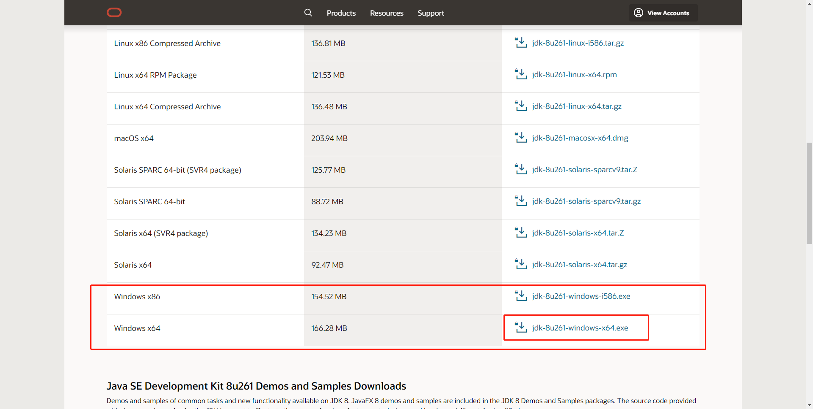
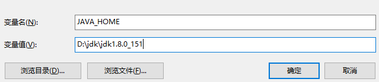
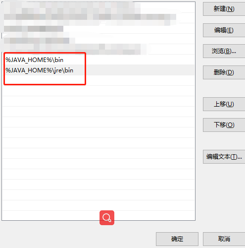

# Java环境搭建

## 卸载JDK

1.删除java的安装目录

2.删除环境变量JAVA_HOME

3.删除path变量下的关于java的目录

4.`java -version` 查看版本，找不到则删除成功

## 安装JDK

* [JKD下载](https://www.oracle.com/java/technologies/javase/javase-jdk8-downloads.html)拉到下面，选择需要的版本
* [百度网盘下载](https://pan.baidu.com/s/1V9Dlm2-iA1l0piR_ZSuHgQ) 提取码`8nxf`

1.双击安装，记住安装位置,若是百度网盘下载，是一个压缩包，解压到要安装的目录即可，记住安装位置。

2.右击我的电脑-选择属性-高级系统设置-环境变量-系统变量-新增一个JAVA_HOME,变量值填你的jdk安装地址

找path变量，里面新增这俩个值

3.`java -version` 查看版本，输出jdk版本，安装成功