# Tomcat环境搭建

## 下载

[官网下载](https://tomcat.apache.org/download-90.cgi)或[百度网盘下载](https://pan.baidu.com/s/1fKbvE_S63pibGYthOGi9pg)提取码`ul1z`

自行选择64位或32位，网盘内是64位

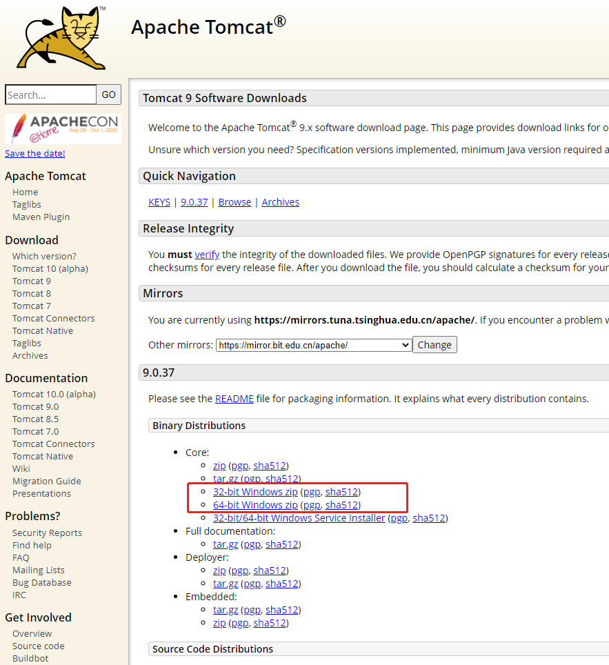

## 解压，配置环境

双击后，会出现窗口，加载完成后，关闭它

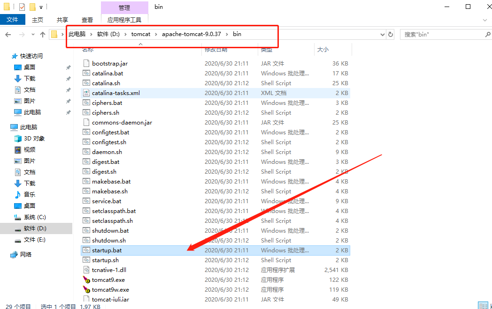

右击我的电脑-选择属性-高级系统设置-环境变量-系统变量-新增俩个

变量名：CATALINA_BASE

变量值：D:\tomcat\apache-tomcat-9.0.37 //Tomcat安装目录

变量名：CATALINA_HOME

变量值：D:\tomcat\apache-tomcat-9.0.37

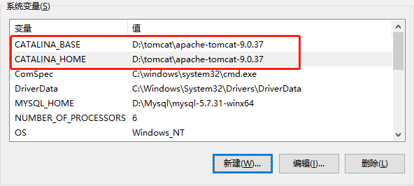

在path变量添加这俩个值`%CATALINA_HOME%\bin` `%CATALINA_HOME%\lib`

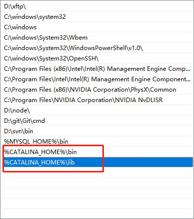

打开cmd窗口，输入`startup`命令，出现以下信息表示安装成功

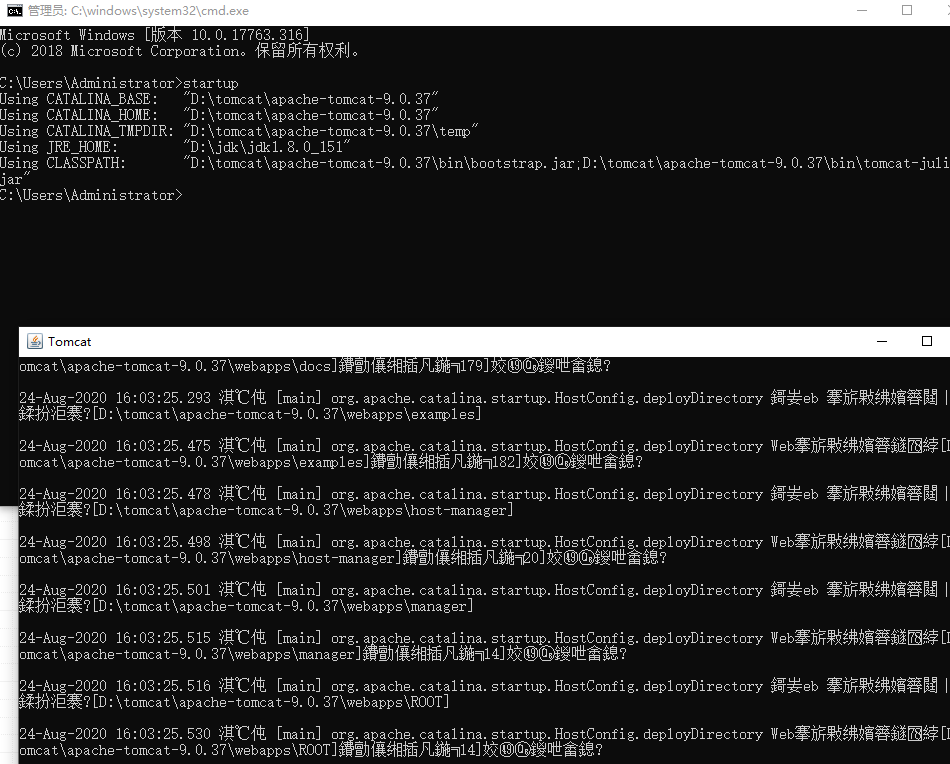

## 在IDEA中配置Tomcat

1、点击Run---EDit Configurations...

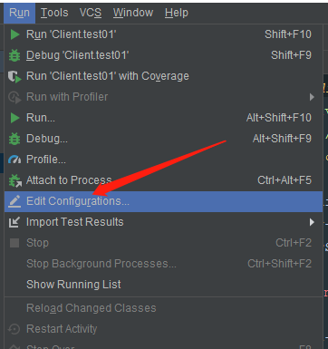

2、点击左侧“+”号，找到Tomcat Server---Local（若是没有找到Tomcat Server 可以点击最后一行 34 items more）

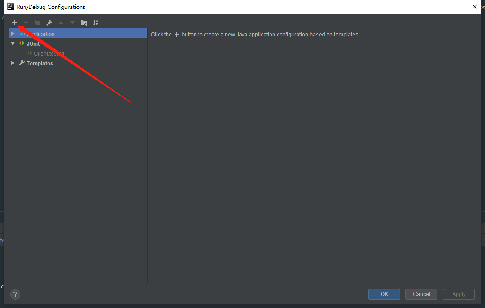

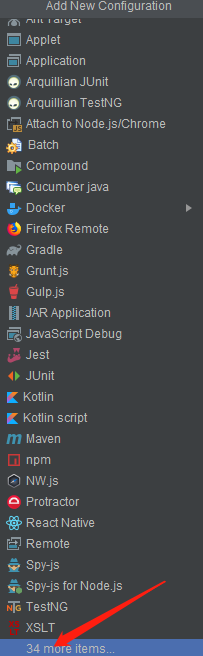

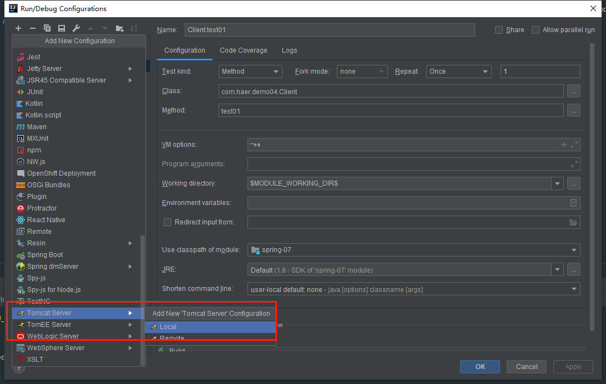

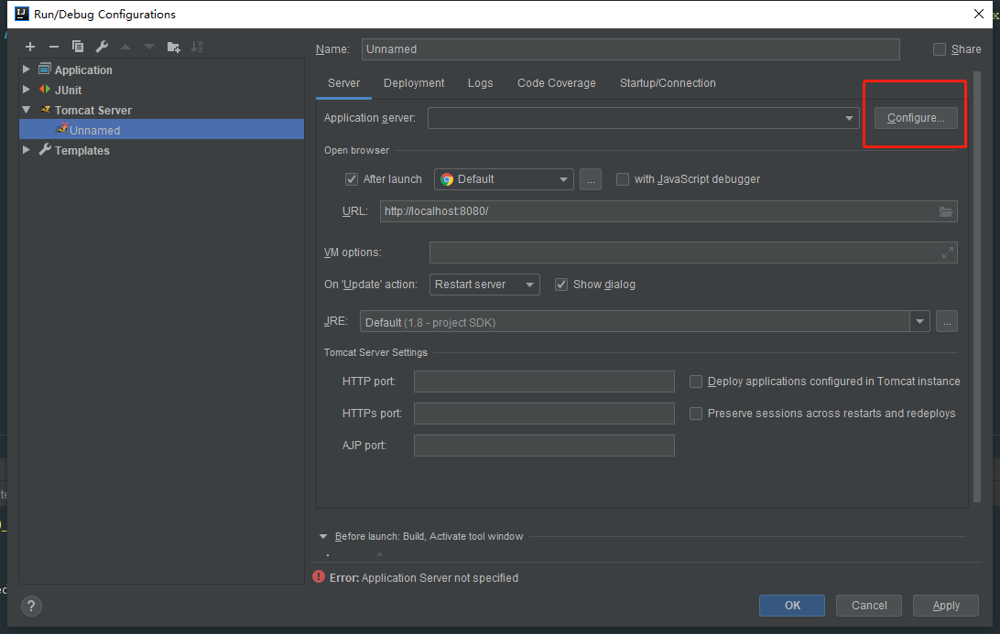

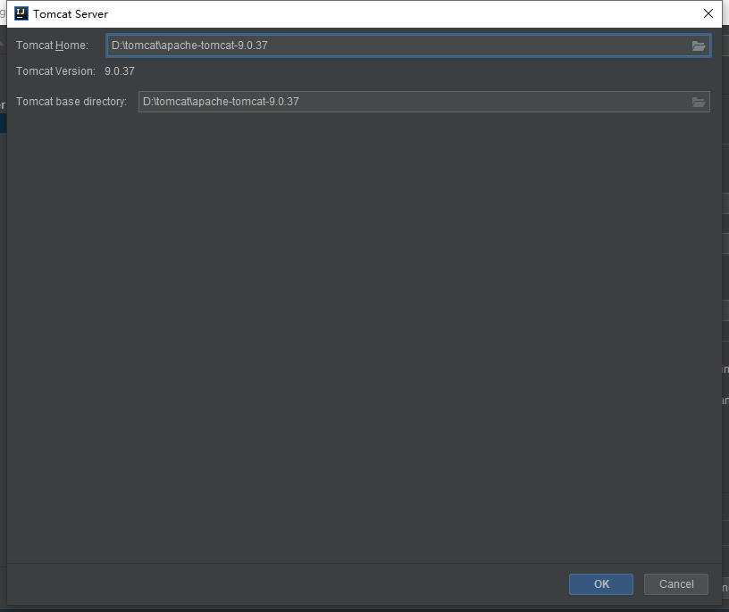