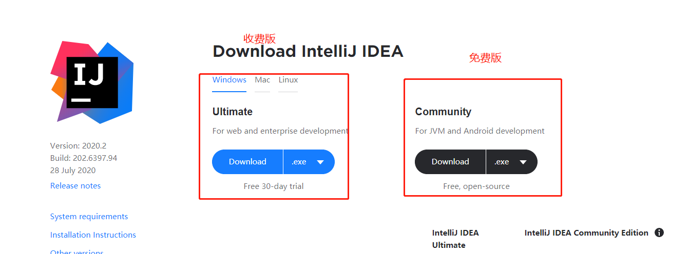
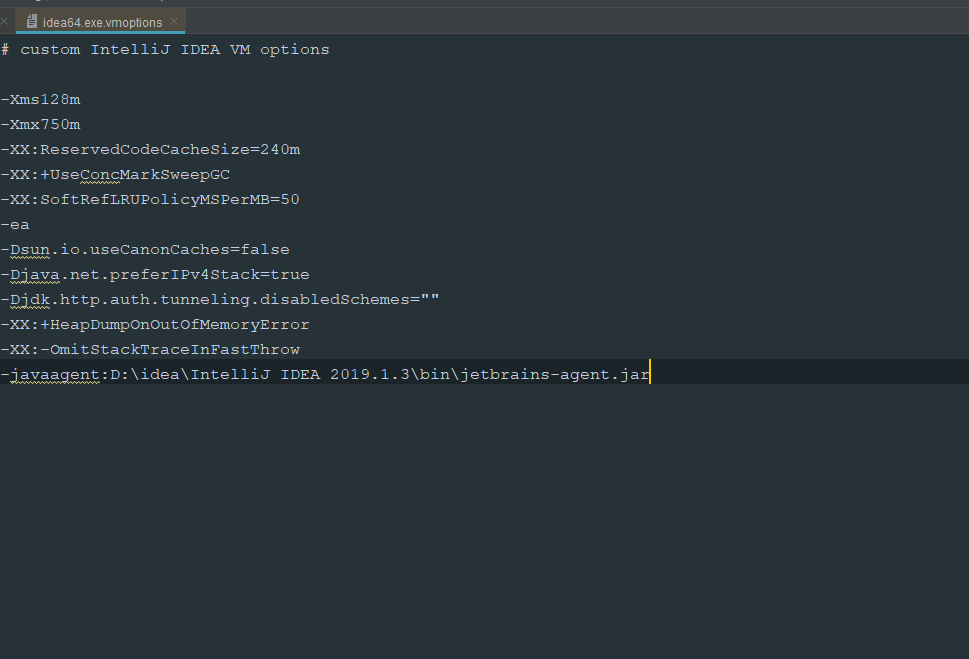

# IDEA

## 下载

[IDEA官网](https://www.jetbrains.com/idea/download)或[百度网盘](https://pan.baidu.com/s/1I4pOftWm4BqFOsxikZBRtw)提取码`yoje`



网盘中是收费版

## 安装

双击下安装即可，简单操作

## 破解

**尽量支持正版**

将网盘中`jetbrains-agent.jar`复制到你安装idea的安装目录的bin目录下,例如：D:\idea\IntelliJ IDEA 2019.1.3\bin下

先打开idea试用30天，然后点击你要注册的IDE菜单：“Help” -> “Edit Custom VM Options …”，如果提示是否要创建文件，请点"是|Yes"。
在打开的vmoptions编辑窗口末行添加：`-javaagent:JetbrainsCrack.jar文件的绝对路径`（一定要自己确认好路径，填错会导致IDE打不开！！！），不管是Mac、Linux、Windows都类似，都是绝对路径。
如我的路径: `-javaagent:D:\idea\IntelliJ IDEA 2019.1.3\bin\JetbrainsCrack.jar`



重新启动你的IDEA。
注册"Help" -> “Register”，选择License server方式，地址填入：`http://jetbrains-license-server` （应该会自动填上），点击activate按钮


点击"Help" -> “About” 查看是否激活成功

若没有激活成功，注册"Help" -> “Register”，选择Activation code方式，填入注册码，若这个注册码失效，去网上搜一个填入即可

```
A82DEE284F-eyJsaWNlbnNlSWQiOiJBODJERUUyODRGIiwibGljZW5zZWVOYW1lIjoiaHR0cHM6Ly96aGlsZS5pbyIsImFzc2lnbmVlTmFtZSI6IiI
sImFzc2lnbmVlRW1haWwiOiIiLCJsaWNlbnNlUmVzdHJpY3Rpb24iOiJVbmxpbWl0ZWQgbGljZW5zZSB0aWxsIGVuZCBvZiB0aGUgY2VudHVyeS4iL
CJjaGVja0NvbmN1cnJlbnRVc2UiOmZhbHNlLCJwcm9kdWN0cyI6W3siY29kZSI6IklJIiwicGFpZFVwVG8iOiIyMDg5LTA3LTA3In0seyJjb2RlIjo
iUlMwIiwicGFpZFVwVG8iOiIyMDg5LTA3LTA3In0seyJjb2RlIjoiV1MiLCJwYWlkVXBUbyI6IjIwODktMDctMDcifSx7ImNvZGUiOiJSRCIsInBha
WRVcFRvIjoiMjA4OS0wNy0wNyJ9LHsiY29kZSI6IlJDIiwicGFpZFVwVG8iOiIyMDg5LTA3LTA3In0seyJjb2RlIjoiREMiLCJwYWlkVXBUbyI6IjI
wODktMDctMDcifSx7ImNvZGUiOiJEQiIsInBhaWRVcFRvIjoiMjA4OS0wNy0wNyJ9LHsiY29kZSI6IlJNIiwicGFpZFVwVG8iOiIyMDg5LTA3LTA3I
n0seyJjb2RlIjoiRE0iLCJwYWlkVXBUbyI6IjIwODktMDctMDcifSx7ImNvZGUiOiJBQyIsInBhaWRVcFRvIjoiMjA4OS0wNy0wNyJ9LHsiY29kZSI
6IkRQTiIsInBhaWRVcFRvIjoiMjA4OS0wNy0wNyJ9LHsiY29kZSI6IkdPIiwicGFpZFVwVG8iOiIyMDg5LTA3LTA3In0seyJjb2RlIjoiUFMiLCJwY
WlkVXBUbyI6IjIwODktMDctMDcifSx7ImNvZGUiOiJDTCIsInBhaWRVcFRvIjoiMjA4OS0wNy0wNyJ9LHsiY29kZSI6IlBDIiwicGFpZFVwVG8iOiI
yMDg5LTA3LTA3In0seyJjb2RlIjoiUlNVIiwicGFpZFVwVG8iOiIyMDg5LTA3LTA3In1dLCJoYXNoIjoiODkwNzA3MC8wIiwiZ3JhY2VQZXJpb2REY
XlzIjowLCJhdXRvUHJvbG9uZ2F0ZWQiOmZhbHNlLCJpc0F1dG9Qcm9sb25nYXRlZCI6ZmFsc2V9-5epo90Xs7KIIBb8ckoxnB/AZQ8Ev7rFrNqwFhB
AsQYsQyhvqf1FcYdmlecFWJBHSWZU9b41kvsN4bwAHT5PiznOTmfvGv1MuOzMO0VOXZlc+edepemgpt+t3GUHvfGtzWFYeKeyCk+CLA9BqUzHRTgl2
uBoIMNqh5izlDmejIwUHLl39QOyzHiTYNehnVN7GW5+QUeimTr/koVUgK8xofu59Tv8rcdiwIXwTo71LcU2z2P+T3R81fwKkt34evy7kRch4NIQUQU
no//Pl3V0rInm3B2oFq9YBygPUdBUbdH/KHROyohZRD8SaZJO6kUT0BNvtDPKF4mCT1saWM38jkw==-MIIElTCCAn2gAwIBAgIBCTANBgkqhkiG9w0
BAQsFADAYMRYwFAYDVQQDDA1KZXRQcm9maWxlIENBMB4XDTE4MTEwMTEyMjk0NloXDTIwMTEwMjEyMjk0NlowaDELMAkGA1UEBhMCQ1oxDjAMBgNVB
AgMBU51c2xlMQ8wDQYDVQQHDAZQcmFndWUxGTAXBgNVBAoMEEpldEJyYWlucyBzLnIuby4xHTAbBgNVBAMMFHByb2QzeS1mcm9tLTIwMTgxMTAxMII
BIjANBgkqhkiG9w0BAQEFAAOCAQ8AMIIBCgKCAQEA5ndaik1GD0nyTdqkZgURQZGW+RGxCdBITPXIwpjhhaD0SXGa4XSZBEBoiPdY6XV6pOfUJeyfi
9dXsY4MmT0D+sKoST3rSw96xaf9FXPvOjn4prMTdj3Ji3CyQrGWeQU2nzYqFrp1QYNLAbaViHRKuJrYHI6GCvqCbJe0LQ8qqUiVMA9wG/PQwScpNmT
F9Kp2Iej+Z5OUxF33zzm+vg/nYV31HLF7fJUAplI/1nM+ZG8K+AXWgYKChtknl3sW9PCQa3a3imPL9GVToUNxc0wcuTil8mqveWcSQCHYxsIaUajWL
pFzoO2AhK4mfYBSStAqEjoXRTuj17mo8Q6M2SHOcwIDAQABo4GZMIGWMAkGA1UdEwQCMAAwHQYDVR0OBBYEFGEpG9oZGcfLMGNBkY7SgHiMGgTcMEg
GA1UdIwRBMD+AFKOetkhnQhI2Qb1t4Lm0oFKLl/GzoRykGjAYMRYwFAYDVQQDDA1KZXRQcm9maWxlIENBggkA0myxg7KDeeEwEwYDVR0lBAwwCgYIK
wYBBQUHAwEwCwYDVR0PBAQDAgWgMA0GCSqGSIb3DQEBCwUAA4ICAQBonMu8oa3vmNAa4RQP8gPGlX3SQaA3WCRUAj6Zrlk8AesKV1YSkh5D2l+yUk6
njysgzfr1bIR5xF8eup5xXc4/G7NtVYRSMvrd6rfQcHOyK5UFJLm+8utmyMIDrZOzLQuTsT8NxFpbCVCfV5wNRu4rChrCuArYVGaKbmp9ymkw1PU6+
HoO5i2wU3ikTmRv8IRjrlSStyNzXpnPTwt7bja19ousk56r40SmlmC04GdDHErr0ei2UbjUua5kw71Qn9g02tL9fERI2sSRjQrvPbn9INwRWl5+k05
mlKekbtbu2ev2woJFZK4WEXAd/GaAdeZZdumv8T2idDFL7cAirJwcrbfpawPeXr52oKTPnXfi0l5+g9Gnt/wfiXCrPElX6ycTR6iL3GC2VR4jTz6Ya
tT4Ntz59/THOT7NJQhr6AyLkhhJCdkzE2cob/KouVp4ivV7Q3Fc6HX7eepHAAF/DpxwgOrg9smX6coXLgfp0b1RU2u/tUNID04rpNxTMueTtrT8WSs
kqvaJd3RH8r7cnRj6Y2hltkja82HlpDURDxDTRvv+krbwMr26SB/40BjpMUrDRCeKuiBahC0DCoU/4+ze1l94wVUhdkCfL0GpJrMSCDEK+XEurU18H
b7WT+ThXbkdl6VpFdHsRvqAnhR2g4b+Qzgidmuky5NUZVfEaZqV/g==
```

